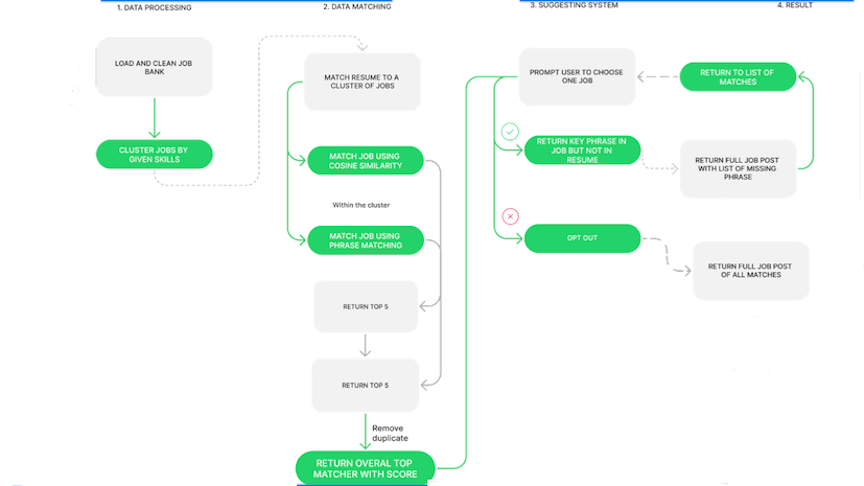

# Introduction

## Motivation

For the last two years, the world has faced two unprecedented events that directly contributed to the dramatic shrinkage of the job market, which are the pandemic - Covid 19, and the war between Russian and Ukraine. During the Covid 19 era, technical related occupations were envisioned to be the invincible profession as the pandemic forced humans to shift the practice of normal activity to online activity. The blooming of e-commerce, cryptocurrency, and e-learning, backed by the swift transformation from small startups to unicorn giants such as Zoom or Coinbase and the surge in market value of FAANG, encouraged businesses to expand their technology sectors, subsequently allow numerous talents to join the field effortlessly. Unexpectedly, Russian initiated the war with Ukraine two years after the start of the pandemic, provoked various economic sanctions, which detrimentally exacerbated the job market that was about to recover. As the inflation index is increasing day by day, the amount of tech jobs that are cut is mounting at a much faster rate. One of the most prominent consulting firm in the field of outplacement services, Challenger, Gray & Christmas, Inc, has conducted a thorough analysis on the striking and unforeseen reduction of job in the tech industry, which is illustrated by the graph below:

Based on the graph, the tech industry in 2021 had a robust laying off rate as the rate stayed close to zero throughout the year; however, by July of 2022, the amount of tech employees got cut off from the industry incline exponentially. This scenario signifies that the tech industry is on the verge of a comprehensive recruitment freeze, which directly affects the employment prospects of the new graduates majoring in Computer Science this year. Beside the sudden vulnerability of employment in the tech industry, this industry has always been known as one of the most competitive sectors due to the tremendous opportunities for growth and high salary. Since the recruiting procedures and result should remain confidential, the exploration of a published data set showing the competitiveness of the tech job market was nearly impossible. Thus, this paper will discuss a anonymous, yet accredited, job application journey across 18 months of a person with 3 years of experience in the tech industry.

The above graph asserted that this candidate had applied to a total of 73 jobs and only 3 jobs resulted in a successful offer, indicating that his acceptance rate is 4.1%. Besides, this candidate is filtered out by most companies in the resume scanning phase, as his chance of not being able to land the first interview is 74%. This example demonstrates that one of the biggest challenges candidates face in the job inquiry process is surpassing the resume round. However, in nowaday talent acquisition procedures, the resume scanning round is no longer performed by a human recruiter, it is scanned and filtered automatically by an all-rounded Human Resources assistant called Applicant Tracking System (ATS). Such a system analyzes resumes by detecting some certain keywords that were either preset by a recruiter or were derived from preset text mining algorithms. Hence, it is perplexing for candidates to surmount the system without the aid of any tools that help analyze the job post and their resume. Thus, this paper discuss the need and the formation of an application assistant tool called Lander, which is a text-mining based tool to help students with finding the most compatible job post based on their past experiences and interests as well as optimizing their resume by a keyword suggestion system.

### Introduction of Applicant Tracking System

The hiring process can be a time-consuming and frustrating experience for employers as well as job seekers. To streamline the process, many companies have started using applicant tracking systems (ATS). An ATS is a computer software program that manages the hiring process. It does this by collecting and sorting thousands of resumes. Hiring managers can then screen candidates using the ATS, as well as track their progress through the hiring process. By digitizing the hiring process in this way, an ATS saves employers time and money. 

There are 4 basic steps to how an applicant tracking system works:

- Step 1: A job requisition enters into the ATS. This requisition includes information about the position, such as the job title, desired skills, and required experience.

- Step 2: The ATS then uses this information to create a profile for the ideal candidate.

- Step 3: As applicants submit their resumes, the ATS parses, sorts, and ranks them based on how well they match the profile.

- Step 4: Hiring managers then quickly identify the most qualified candidates and move them forward in the hiring process. 

To be continue: 

- What is the backlash of Application Tracking System? : Can be bias and not flexible, lack of transparency
As a candidate, they really doesn’t know what exactly ATS is looking for

- How lander can help candidate surpass this system?

## Current State of the Art

### Match job to resume

### Cluster job bank to different cluster based on skills

### Return matched job using cosine similarity and phrase matcher

### Return list of missing keywords

## Goals of the Project

## Ethical Implications

This document requires that you discuss the ethical implications of your work -- no
matter how benign you consider the outcome of your project. As several major studies
of ethical issues in computer science assert: _no project is completely value-neutral_.

To assist you in elaborating on these issues, the following areas are topics you might
consider addressing. You do not need to address all of them.

* Information Privacy
* Information Accuracy (e.g. can contain reliability)
* Potential Misuse (e.g. computer crime, unintended consequences)
* Second- or Third-Party Risk (e.g. safety)
* Data Collection Issues (e.g. issues inherent in collecting data)
* Algorithmic or Data Bias
* Potential Power Difference / Social Imbalance / Issues in Equity

In addition, reflect on ways that the above harms can be or are mitigated by your work

# Related work

This chapter includes a broad and detailed review of relevant existing work.
The literature review should provide background and context for the thesis work.
The subsections may be organized in whatever manner seems best suited to the material--
chronological, or by topic, or according to some other criteria
(e.g., primary versus secondary resources).

If ethical issues are central to this work, you should also address historical and
contemporary issues or efforts made to address them.

# Method of approach

This chapter answers the "how" question - how did you complete your project,
including the overall design of your study, details of the algorithms and tools you
have used, etc.  Use technical diagrams, equations, algorithms, and paragraphs of text
to describe the research that you have completed. Be sure to number all figures and
tables and to explicitly refer to them in your text.

This should contain:

* lists
* with points
* and more points
  * possibly subpoints

For those projects whose implications address social or moral issues (i.e. ethical
standards, causes, effects), you will want to use this section to describe how you
actively mitigated or considered these issues.

# Experiments

This chapter describes your experimental set up and evaluation. It should also
produce and describe the results of your study. The section titles below offer
a typical structure used for this chapter.

## Experimental Design

Especially as it pertains to responisble computing, if conducting experiments or
evaluations that involve particular ethical considerations, detail those issues here.

## Evaluation

## Threats to Validity

# Conclusion

Traditionally, this chapter addresses the areas proposed below as sections, although
not necessarily in this order or organized as offered. However, the last section --
"Ethical Implcations" is required for this chapter. See the heading below for more
details.

## Summary of Results

## Future Work

## Future Ethical Implications and Recommendations

Especially as pertains to the public release or use of your software or methods, what
unresolved or special issues remain? What recommendations might you make?

## Conclusions

# References

::: {#refs}
:::
