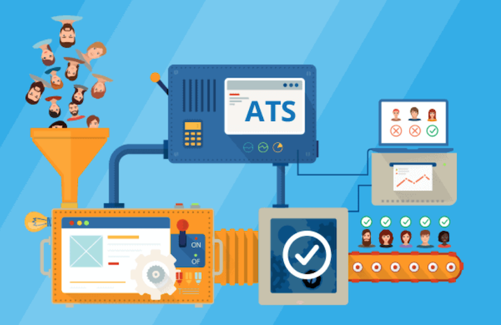
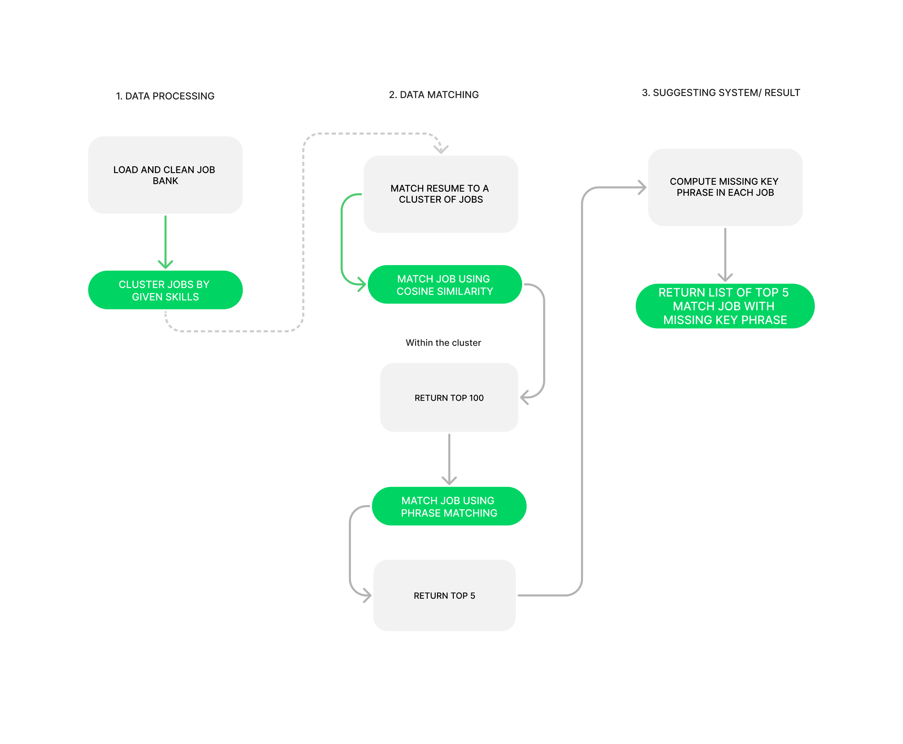

# Introduction

## Motivation

For the last two years, the world has faced two unprecedented events that directly contributed to the dramatic shrinkage of the job market, which are the pandemic - Covid 19, and the war between Russian and Ukraine. During the Covid 19 era, technical related occupations were envisioned to be the invincible profession as the pandemic forced humans to shift the practice of normal activity to online activity. The blooming of e-commerce, cryptocurrency, and e-learning, backed by the swift transformation from small startups to unicorn giants such as Zoom or Coinbase and the surge in market value of FAANG (abbreviation for Facebook, Appe, Amazon, Netflix and Google - the biggest fives technology corporation based on revenue and market share ), encouraged businesses to expand their technology sectors, subsequently allow numerous talents to join the field effortlessly [@harvard_business_review_2022]. Unexpectedly, Russian initiated the war with Ukraine two years after the start of the pandemic, provoked various economic sanctions, which detrimentally exacerbated the job market that was about to recover. As the inflation index is increasing day by day, the amount of tech jobs that are cut is mounting at a much faster rate. One of the prominent consulting firms in the field of outplacement services, Challenger, Gray & Christmas, Inc, conducted a thorough analysis on the striking and unforeseen reduction of job in the tech industry, which is illustrated by the graph below:


Based on the graph, the tech industry in 2021 had a robust laying off rate as the rate stayed close to zero throughout the year; however, by July of 2022, the amount of tech employees were cut off from the industry incline exponentially. This scenario signifies that the tech industry is on the verge of a comprehensive recruitment freeze[@june_2022], which directly affects the employment prospects of new graduates majoring in Computer Science and other tech related majors this year. Mark Zuckerberg , Meta CEO (formally known as Facebook) wrote, in a message to employees prior to the laying off 13% of its workforce, “At the start of Covid, the world rapidly moved online and the surge of e-commerce led to outsized revenue growth. Many people predicted this would be a permanent acceleration that would continue even after the pandemic…Unfortunately, this did not play out the way I expected.” The controversial employment cut from Meta was the result of an unexpected, yet massive, loss of this company valuation. In 2021, Meta’s valuation peaked at 1 trillion dollars, while in October of 2022, the home of Facebook, WhatsApp, and Instagram value shrinked to merely 300 billion dollars[@picchi_2022]. Apart from Meta, several other giant tech companies also announced their employment cut in the last 4 months, including Amazon, Microsoft, and Stripe. As these top tier companies are struggling to reduce their cost by laying off employees, they have freezed their hiring process until further notice[@wamsley_2022]. Hence, the top tier students who were supposed to have another application pool, as they would only apply to the powerhouses and compete with those at the same level, now have no choice but to migrate to the standard application pool. This implies that it will be much harder for students who have less skills, less experience, graduating from a smaller school, and possessing other disadvantages, to successfully land a job. 

Beside the sudden vulnerability of employment in the tech industry, this industry has always been known as one of the most competitive sectors due to its tremendous opportunities for growth and high salary. Since the recruiting procedures and its outcomes should remain confidential, the exploration of a published data set which can describe the competitiveness of the tech job market was nearly impossible. Thus, this paper will discuss an anonymous, yet accredited, job application journey across 18 months of a person with 3 years of experience in the tech industry.


The above graph asserts that this candidate applied to a total of 73 jobs and only 3 jobs resulted in a successful offer, indicating that his acceptance rate is 4.1%. Besides, this candidate is filtered out by most companies in the resume scanning phase, as his chance of landing the first interview is 21%. This example demonstrates that one of the biggest challenges candidates face in the job inquiry process is surpassing the resume round. However, in nowaday talent acquisition procedures, the resume scanning round is no longer performed by a human recruiter, it is scanned and filtered automatically by an all-rounded Human Resources assistant called Applicant Tracking System (ATS). Such a system analyzes resumes by detecting some certain keywords that were either preset by a recruiter or were derived from preset text mining algorithms. Hence, it is perplexing for candidates to surmount the system without the aid of any tools that help analyze the job post and their resume. Thus, this paper discuss the need and the formation of an application assistant tool called Lander, which is a text-mining based tool to help students with finding the most compatible job post based on their past experiences and interests as well as optimizing their resume by a keyword suggestion system.

## Introduction of Applicant Tracking System and its disadvantages to applicant

In the era of automation, the traditional hiring process slowly became deprecated, especially in a massive field such as technology. CompTia, a recognized cybersecurity platform, asserted in their State of the Tech Workforce that there were nearly 4 millions new tech jobs posted by employers across multiple job boards. In order to deliver a hiring decision efficiently, the Human Resources department tilted toward integrating Information Technology and Database Management into the hiring process[@mukherjee2014role]. Electronic Human Resources Management (e-HRM in short) is the first system that successfully incorporates cutting-edge technology into leveraging the performance of the human resources department. Applicant Tracking System is the later born of e-HRM, and it is solely in charge of the talent acquisition sector. An ATS is a computer software program that manages the hiring process. It does this by collecting and sorting thousands of resumes. Hiring managers can then screen candidates using the ATS, as well as track their progress through the hiring process. By automating the hiring process in this way, ATS system is believed to deliver accurate, cost effective and efficient hiring decisions.


Recruiting procedures normally consists of 7 stages, which are:

1. Applying: candidate applying to the position through multiple sources

2. Assessments and Testing: initial screening, contain but not limited to: resume screening, technical screening, and behavioral questionnaires. ATS has the role of hosting and regulating this step.

3. Application Review: recruiter review ATS’s qualified candidates

4. Interview: recruiter interview selected candidates, this round may consist of technical interview, behavioral interview, and panel interview.

5. Job offer: After initial screening and interview, the recruiter finalizes the hiring decision and extends an offer to successful candidates.

6. Pre-employment: this stage determines if candidates are eligible to work via background check, reference check, and finalize employment documentations.

7. Onboarding: successful candidates are lawfully able to work in the offered position, and will be integrated to the new position immediately

According to the description of recruiting stages, the initial screening stage incorporated ATS eliminates the largest number of applicants. Thus, candidates who want to excel the application process need to understand how ATS work. 

 

There are 4 basic steps to how an applicant tracking system works:

- Step 1: A job requisition enters into the ATS. This requisition includes information about the position, such as the job title, desired skills, and required experience.

- Step 2: The ATS then uses this information to create a profile for the ideal candidate.

- Step 3: As applicants submit their resumes, the ATS parses, sorts, and ranks them based on how well they match the profile.

- Step 4: Hiring managers then quickly identify the most qualified candidates and move them forward in the hiring process. 

In step 1, the type of job requisition that provides comprehensive information about the position is job description. By definition, the job description is “a list of job duties, responsibilities, reporting relationships, working conditions, and supervisory responsibilities ”.  In step 3, the ATS utilizes the application of Artificial Intelligence and Natural Language Processing to help recruiters filter out and rank qualified applicants. Whilst some perceive that ATS has tremendous benefits to the field of talent acquisitions, others believe that the algorithm-based filtration of ATS may have rejected numerous qualified candidates as their resume does not contain the key phrase that was identified as important for the role by the ATS. 

## Current State of the Art

Applicant Tracking System started to intergrate in the recruiting practice from the 90s, replacing the piles of document on the table of recruiters and providing them a platform to keep track of applications and their status[@predictive_talent_acquisition_software]. The very first version of ATS acted solely as a database management system with a better queries for application tracking. In the 2000s, with the blooming of the internet, traditional recruiting strategies shifted to online-based, marking the birth of online application and job boards. Accordingly, the massive amount of online applicant urged the ATS to have two more applications: match candidate to the suitable job post and rank the candidates base on level of compatibility with the job. Josh Bersin asserted in his “HR Technology Disruptions for 2018” report that “hiring people is by far the most important thing companies do”, which emphasize the significant of having an effective and accurate recruiting procedure for the growing applicant pool. Hence, ATS is continuously growing in the field and slowly become an irreplaceble part of recruitment. 

![Current Value of Applicant Tracking System [@kbv_research_2022]](images/stateoftheart.png)

According to Research and Market, the Global Applicant Tracking System Market size is expected to reach $3.3 billion by 2027, rising at a market growth of 7.1% during the period of 2020 - 2027[@kbv_research_2022]. Such an increment signify that ATS is a growing practice, and the amount of companies utilizing ATS has expanded globally. Despite the exponential growth of ATS, the top ATS applications such as Workday, Taleo (Oracle), SuccessFactors, and Kenexa Brassing (IBM) secure their standing across Fortune 500 company[@kelly_2020], while the ranking of ATS tools usage across the market is quite different, in which Taleo, Greenhouse Software, and Homegrown clinch the top 3 standings[@ghosh_2022]. 

![Current Market Share of Applicant Tracking System [@ghosh_2022]](images/ATS_marketshare.png)


According to both of the ranking, Taleo is ranked as one of the most prominent ATS in the field of talent acquisition regardless of the size and market value of the company. Thus, this paper examine the internal of an ATS and how it work using Taleo as the case study.


### Taleo (Oracle)

Owned by Oracle, Taleo Cloud Service is a talent management solution designed for businesses of any size to help HR recruiters and management attract and retain key staff. The platform provides the tools necessary to track applicants and keep tabs on recruiting data that is accessible anytime and from anywhere. The Taleo system relies on social media platforms and integrates with Facebook and Twitter. It also integrates with productivity tools including Microsoft Outlook and Google. Taleo works as a useful and effective way to onboard new recruits and features a custom new hiring portal that stores new employee data. It also provides users with a recruiter/hiring manager dashboard to help identify any onboarding issues that may arise.

Several key features of Taleo include cost savings (in which data on Taleo is managed by cloud-based service) and social media and productivity integration (as Taleo is interconnected with significant social media platforms). These key features along with Taleo comprehensive ATS service such as applicant trascking, dashboards, and integration APIs helps recruiter to acquire efficient hiring decisions. Some companies use Taleo are: Starbucks, Nike, Nintendo, Tesla, United Airlines, etc..

Taleo streamlines the talent acquisition procedure by ranking and filtiring applicants using 4 methods:

- Method 1 - Tiered Scoring for Knockout Questions: Knockout questions are pass/fail questions that are commonly used in the application by recruiter to filter out candidate who doesn't meet some baseline requirement, such as "Do you need sponsorship now or in the future?", "Are you lawfully allowed to work in US without limitations?". Taleo allows recruiter to put in tier grading for every knockout questions and filter out candidates according to the requirement of the recruiter. 

- Method 2 - Bonus Points for Certain Resume Keywords: A recruiter can set up Taleo to assign some amount of bonus point to an applicant that mentions one of the skills in the required skills or recommended skills section of the job description, or some other keyword that help recruiter to identify potential candidates. This bonus scoring system helps Taleo to rank candidates who passed knocked-out questions round.

- Method 3 - Automatic Resume Scoring: Even if a recruiter opts not to manually assign extra points to certain keywords, Taleo automatically scores applications and resumes based on their contents in what they call “Req Rank.” Taleo parses the text from candidate resume and application then compares it to the job description. Then, Recruiters can filter out applicants that don’t score above a certain threshold.

- Method 4 - Boolean search: Recruiters can search their applicant pool within Taleo for specific skills and keywords, or even craft complex Boolean searches with  “and,” “or,” and “not” operators (among other modifiers) to fine tune their results. These keywords are normally the key skills that recruiter require the candidate to have in their resume. 


## Goals of the Project

With the hiring freeze and the increase in demand for experienced workers in technology industry, the new graduate classes are facing the challenging of not being able to secure a job right after graduation. Moreover, the amount of graduate student who are struggle to find their suitable job title in the overwhelmingly massive job market has increased exponentially. Thus, the whole purpose of Lander is to become an automated resume coach which provide an open source, free, and user friendly tool for any candidate who are currently in the limbo of job searching by matching the candidate to the suitable job by calculating the similarity between the candidate resume and the job description, and helping candidate to identify certain keywords that they should include in their resume to pass the ATS resume scanning round. After the keywords identification process, user can incoporate those keyword into their resume in order to elevate their resume. Lander is certainly not trying to inspire candidate to manipulate the hiring process, it is only a method for candidate to determine and apply to their suitable job efficiently and successfully. 


As recruiter utilize ATS to increase the performance of their job, the candidate also have the right to apply Lander in their job application journey to increase the chance of getting into desired position. Moreover, the ATS system, if falls into wrong hand, may turn to a systematic bias in the process of making hiring decision as recruiter can modify the scoring or ranking system to make sure that candidate fit their narrative instead of matching the job requirement, so Lander can be a way for candidates to offset these hidden scheme for hiring if any. 

## Ethical Implications

- Data collection issue: The database used for Lander is adopted from Kaggle, and this dataset is scraped from Dice.com, a job board website. Even though dice allows scraping and Kaggle provides open source dataset, this tool will use this database to support job seeker and may direct the user directly to the original job post, not to dice.com, which may reduce the revenue of this job board website. 

- Potential social issue: This tool helps job seeker to identify suitable jobs and leverage their resume using algorithms, posing a big question - Will ATS/recruiter discriminate against using this tool?

- Potential misuse - unintended consequence: Does this tool tell people to lie, as candidate may include the keyword that are not applied to them.

- Information privacy: As an application that prompting resume and other private information from user, it is prone to have confidentiality problem. So, there is a need to make sure that the information in the resume is secured.

# Related work

## The big picture of Applicant Tracking System and its advantages

Emerged in the talent acquisition industry from the 1990s, Applicant Tracking System has become an indispensable tool in the field of recruitment.  Human resources departments “have been the organizational business units most averse towards information technology (IT) for decades” (Laumer et al.) [@laumer2015] as the automation in a sector that requires human intervention is complicated to regulate. In a survey conducted by Gupta et al in late 2018 across recruiters about their opinion on the impact of technology on talent acquisition sector, the demonstration of the final result is as follow:  

Table: The survey on the impact of ATS on the performance of recruitment [@gupta]

| Criteria                                                                       | Agree | Disagree     | Neither      |
|--------------------------------------------------------------------------------|-------|--------------|--------------|
| With Technology, recruiting is potentially Better, Faster, and Cheaper         | 96%   | Not reported | Not reported |
| Technology enables the understanding of the longevity of the employees         | 50%   | Not reported | 39%          |
| Technology usage in hiring improves Hiring cost                                | 77%   | Not reported | Not reported |
| Technology usage in hiring improves ‘‘Quality of hire’’ metrics                | 79%   | Not reported | Not reported |
| Technology usage in hiring improves ‘‘Competency/skills gap analysis’’ metrics | 75%   | Not reported | Not reported |
| Technology usage in hiring improves ‘‘Professional development’’ metrics       | 73%   | Not reported | Not reported |
| Technology usages in hiring will miss significant candidates                   | 35%   | Not reported | 44%          |
| Technology usage in hiring improves the transparency to all stakeholders       | 65%   | Not reported | Not reported |


From the report, Applicant Tracking System does not only play an important role in increasing the performance metricts of recruitment process, it is also a potential solution to tackle one of the most controversial issue in the talent acquisition sector: the transparancy of hiring decision. The incorporation of technology in delivering hiring decision may help to reduce the biases in the process as the initial scanning is performed by machine with high level of accuracy. Most Applicant Tracking System software, such as Taleo, has a scoring system which quantify the similarity between a candidate profile and a job post and finalize the ranking of the whole pool of candidates in a short amount of time. Such a metric is supposed to be free of biases as human recruiter can't intervene the calculation of pure similarity point. 

The description of Applicant Tracking System within the above Introduction section is only about one of the numerous applications of ATS in recruitment - which is resume screening - the actual ATS software is a comprehensive tool which involved in every step in recruitment. Creating a job post automatically base on recruiter entry and posting said job post on multiple job board is the very first usage of ATS in the recruitment pipeline. Then, ATS also leverage the branding practice of a job post by governing the advertisement of such job on multiple platform. Besides, several administration duties are conducted effectively by ATS such as: collecting resume, keep track of application status and recruitment status, send email to candidates at different stages of recruitment process. 


![A typical ATS and its component [@koteswariuse]](images/ats_every_step.png)

In addition to the typical component that most ATS is having above, several ATS software has broaden the horizon of the involvement of it in the recruitment, for example: "Hirevue introduced AI-enabled technologies that will analyzing appearance and languages, how the applicant is answering for every question to identification of style of speaking (Izario et al., 2017), this mechanism will help to select right talent into the enterprise." (Nawaz, Nishad) [@nishad]. Such an advancement magnify the incorporation of ATS within the candidate screening procedure in which ATS can evaluate the candidate using the interview video as well, and it soon become significant. During the 2020-2021 recruitment cycle, due to the burden of the social distancing guidelines, several company had transformed their first interview round, with the intention to acquire more information from the candidate, to video recording in which candidate can record their responds for acquired questions and submit it to their application. Thus, on the stance of recruiters and human resources officers, the impact of ATS on their duties at this moment is far exceed the recurring limitations that it is holding.

## The problems of Applicant Tracking System

Even though the benefit of ATS is indisputable on the recruiter end, its limitations is detrimental to candidate, especially those who have insufficient knowledge and experience with ATS-driven job application procedures. These candidates are, but not limited to, new graduate candidates and senior candidates seeking for new job after a long period of time. The majority of potential disadvantages of ATS lies in the candidate screening process due to the complications of Machine Learning algorithms. 

### Methodology of candidate screening in ATS

ATS often time utilizes supervised learning as the hidden layer of candidate selection and candidate ranking.Supervised learning occurs when algorithms are loaded with instructional data and correct answers. The task of machine learning is to memorize the training databases and apply the gained knowledge, all based on real data. Supervised machine learning algorithms are described as learning functions Y=f(X), where the tool based on AI makes predictions about the future (Y) and new variable input data (X) [Le, 2021]. In ATS, the training database can be the profile of successful candidate while the correct answer in this context is the compatible job title with such profile. The continuous feeding of candidate data to the tool will help it finalize the list of key skills for each job position. Then, these key words incorporate into the formation of job description or the candidate selection for a job position. 

### Harmful feedback loop of Supervised Learning

One of the most controverial issue of supervised learning is if the training data solely come from the past record, the predictions computed from such dataset may follow the pattern of the training data, which subsequently increase the level of bias in deliveration of predictions. The reason is supervised learning follows strictly the given record and unable to realize the possible mistake from the past database. Such a scenerio is labeled a harmful feedback loop, which "prevents the system from improving over time by removing the presence of unbiased data." [@soni_2022]

As the algorithms in ATS are mostly supervised learning, it is inevitable to retain harmful feedback loop. The notorious example of a harmful feedback loop in delivering hiring decision using automated recruitment assistance is Amazon in 2014. The giant in technology had developed a tool with a desire to identify the candidate in a large pool of candidate efficiently, which possessed the same concept with a typical ATS. Despite the promised prospect, the tool turned out to discriminate againts women candidates as the trained database was dominent by male candidate. In the database, which include the profile of successful candidates in Amazon for the last 10 years, the amount of male applicant were overwhemingly more than the female candidates, which give the tool a perception that male candidate is preferred, while resumes containing the word "women" are reserved for other type of occupations[@hamilton_2018]. 

### Inflexibility in ATS screening

Apart from unconcious biases from algorithms, ATS holds another challenges to job seekeer: The system is highly inflexible. ATS rank candidates based on how compatible they are to a job post, and the compatibility occured only if the resume consists of the exact key word that the ATS is looking for. Hence, candidate with decent skills and experience can still be filtered out if the wording is not aligned with ATS's preset paremeters [@rony_2020]. Apart from keywords, ATS is also reported to have problem with compiling different formats, fonts, and the majority of graphic. 


For example, ATS is unable to parse a resume correctly if the heading is worded slightly different to how ATS is programmed, or fail to identify the synonym of a certain keyword. Table 1 also suggests that nearly 80% recruiters either agree or having mixed feeling about the fact that the usages of technology like ATS in hiring process will cause company to miss significant candidates. 

## Approaches to resolve ATS issue on the stance of candidate

The research for an application that focus on improving candidate experience with ATS was challenging as ATS is a fairly new concept, and the majority of scholarly conducted articles on such topic are about the introduction of ATS and its impact on recruitment procedures. Thus, this paper will only examine two tools that imitate the work flow of an ATS to help job seekers overcome the limitations of ATS, which are: Resume Scan and Job Scan.

### Resume Scan

Resume Scan is a two-ways tool with the purpose of enhancing the performance and experience of both recruiter and candidate by proposing a system that can handle Application Tracking and Career Prediction Model at the same time [@sippy_2021]. This tool is a research-based project, which is conducted by a group of undergraduate research student and their professor at the Thadomal Shahani Engineering College in India. The motivation for their research is that 60% of engineering students remain uncertain about their career prospect by the time of graduation, and they also want to provide an inexpensive recruitment tool for recruiters.

1. Application Tracking Approach


![Applicant Tracking Pipeline [@sippy_2021]](images/forrecruiter.png)

In the Application Tracking end of the tool, Resume Scan evaluates the compatibility of a candidate to a job by comparing the skills mentioned in the candidate resume to the requirements of the company. The system identifies candidate skills by extracting the relevant information from the resume and store in a list, whilst prompting the company requirements from the recruiter for such a position and store in the other list. Finally, Resume Scan compute the matching percentage by purely calculating the similarity between the two lists of keyword and ranks the candidates based on this metric.


2. Career Prediction Model Approach

![Career Prediction Model Pipeline [@sippy_2021]](images/forstudent.png)

In order to implement the Career Prediction Model, Resume Scan first classifies the possible skills of candidates into different categories, i.e: Technical Skills, Management skills, Data Science, etc. Then, the tool extracts candidate skills from their actual resume and compares the skills list with the pre-stored skills in different domains. Finally, the tool will return the domain of career with the highest matching percentage to the user. 


### Job Scan

Unlike Resume Scan, Job Scan is an actual published ATS-counter application that has been used by more than 1 million job hunters. James Hu, the founder of JobScan, created the tool due to his own struggle with applying to job in the age of ATS-driven screening. The only targeted user of Job Scan is job seeker, in which the tool will help them to leverage their profiles from the inside out by polishing their resume, cover letter, LinkedIn profiles, along with educating user about ATS using a wide range of resourseful articles. 

#### Methodology

Even though Job Scan doesn't publish a paper to describe their workflow and there has yet been a scholarly published paper on this tool, this application has been recommended by numerous experienced job coaches. Jobscan giving resume matching score by conducting a comprehensive analysis of candidate's hard skills, education, job title, soft skills, other keywords [@steph_2022]. Other metrics such as word count, words to avoid, section headings, file type, format, and seniority level match is also incorporated in the Scan Report.


From the result of the Keyword Comparison section, the matching calculation may weight the score using term frequency in which the matches with the keywords that have higher frequency in the job description affect the overall score more than keywords with lower frequency. Besides, Jobscan also incorporates a tag called predicted skills. This section utilizes supervised learning by using the database of Jobscan on the job post with the same job title and compute some predicted skills that apply to the role but are not on the specific job post. Catering to beat specific ATS software is another specialty of Jobscan. Since different ATS software has their own strengths and weaknesses, Jobscan scrutinizes the most used software such as Taleo, Workday, iCIMS, etc. and provides specific advice to candidates when facing each software. For example, a tip from Jobscan to beat iCIMS is: “iCIMS does not recognize different tenses, abbreviations, or acronyms of skills and keywords. Tailor your resume keywords to be an exact match to what is found in the job description.” [@steph_2022]

#### Limitations

Despite the tremendous benefit of Jobscan, Steph Cartwritght, a Job Search Strategist and Certified Resume Writer, asserted that this applications holds several drawbacks that job seeker should keep in mind when analyzing their Scan Report [@steph_2022], including:

- Too much emphasize on matching score: The scanned score is based on the keyword matching with keywords identified by Jobscan, while the list of keyword that ATS use may be different. 

- May include buzzwords such as passionate, encouraging, impact, etc. in the important keywords section - this can be a problem with keyword extraction algorithms.

- Some redundant features for monetization: Steph claimed that some Jobscan feature such as LinkedIn optimization and Cover Letter optimization are unnecessary as ATS will not scan cover letter, unlike what Jobscan claimed, and LinkedIn profile should remain simple and personalized as much as possible.


# Method of approach

## Approach proposal and reasoning

Whilst one of the most prominent Resume Optimization tool - Jobscan claims that their service boosts interview callback chance by 300%, the major drawback of such a tool is: How's about the next step? With a resume consists of all important keyword, the client who uses JobScan can become the desired candidate for any job title. However, since JobScan solely suggests candidates to include more keywords and skills that a recruiter want from them for a specific title, candidates may have a false assumption that they can get a job with more keyword in their resume. The truth is, a good resume, regardless of how high the matching percentage it has to the job description, only have the power to help candidate improve the chance of getting an interview, not getting the job. In order to improve the chance of landing a job successfully, it is important to match the candidate to the job title that is favorable to their prior degree and experiences. Thus, the pipeline of Lander consists of two main steps:

1. Match candidates to a cluster of job title in a job banks using Kmean prediction

2. Match candidates to top jobs within the cluster and give resume optimization suggestions

This method draws a big picture of job hunting for candidate, in which their desire job title may not be suitable to their strengths, but other job title does. After a thorough assessment of several existed platforms which dedicate to supporting candidate in resume optimizing and career recommendating, one of the other most significant problems with these platforms is monetization, as these platforms modifying the scanning output in order to lure client to upgrade their plan. Lander is an all-in-one job-seeking assistant which is, and will always, remains free and accessible for anyone. The heart of this platform is the evaluation of job fit using two metrics: Spacy Phrase Matching Score and Cosine Similarity Score. 

## System Design



Lander workflow consists of three stages, including

- Data Processing: This stage performs data cleansing on job bank to ensure all entries are consistent. Then the databased will be clustered into groups based on different skills requirements.

- Scoring System: This stage calculates the matching score between a resume and every job in one cluster using Cosine Similarity to narrow down the search and then using Phrase Matching technique to compute skill matching percentage

- Reccommendation System: This stage sorts the matching score across one cluster and return the top 5 of each metrics, then return the important phrase in a chosen job which has yet been mentioned in the resume.


### Data Preparation: 

#### Preparing data for resume scanning
1. Data retrieving

The initial stage in developing an automated job scanning tool is gathering information, particularly real resumes and example job descriptions from various technical occupations. This study makes use of a job bank with 22,000 entries that Kaggle collected from Dice.com, a real job dashboard. This job bank has 12 data columns, each of which represents a different piece of essential job post information. For testing purposes, this project also makes use of a collection of 3 resumes retrieved from the author and an open source career document from Ohio University and Carnegie Mellon University. These resumes correlate to a similar level of seniority in the tech industry, which is entry level. All resumes are in PDF format, so PyPDF2 is used to extract the text from resumes. The Panda library serves as the primary tool for extracting and storing the database for job banks. The first step is to divide the dataframe into a sub-dataframe that only contains the three pieces of information that are crucial for calculation: "Job Title," "Job Description," and "Skills."

2. Data cleaning

After the extracted data is stored into the data frame, the next essential step is to abolish unnecessary component from the data. `re` library, abbreviation of regular expression, is the library mainly use for finding a string or a set of string using special regex pattern; such library is useful in locating special punctuation, new line, other meaningless text in the document and replace them with white space. In this case, all redundant information is ommited from the important dataframe, including empty cell, or `Skills` cell with a value of "See Job Description", "See Below",...

Example of one cleansing step

```python
  for token in tokens:
    if re.search("^[A-Za-z0-9+_-]*$", token):
      filtered_tokens.append(token)
  stems = [stemmer.stem(t) for t in filtered_tokens]
  return stems, filtered_tokens

```

The above code snippet performs data cleansing in the skills and job description column, in which only tokens that consists of natural language without special symbol can stay in the data set. Then, the skills and job description are stemmized, which is the process of reducing a word to its word stem that affixes to suffixes and prefixes or the roots. This action benefits the calculation process later on, as it improve the accuracy of cosine similarity calculation.

3. Data processing and final checking

In this stage, the data frame will become a simple and consistent format for further advanced analysis. The process include 3 steps:

-  Word tokenization: turn long text in resume and job description into token (single word) to make the analyzing process easier using Scipy

- Stop words: Remove word that are meaningless for resume scanning and job description processing but tends to appear a lot. NLTK library have a built-in list of stop words that was utilized in this project

- Lemmatization: Globalizing the input entry by returning the text into its meaningful base form using WordNetLemmatizer

After this stage, a data frame called `data_eval` is formed, which consists of pre-processed texts for evaluations. 

#### Comprehensive skill extraction (Alternative approach to data preparation after testing)

After trials of clustering jobs based on given skills on the input job data, an unexpected inconsistency between number of job within each clusters repeatedly occured regardless of any normalization attemp on the database. At that time, there were some cluster having 6000+ entries while some other cluster only have roughly 100 entries. Even though a thorough investigation on such an behavior has not been conducted due to the complication level of clustering jobs by hand to test the accuracy of the cluster output, the central of this issue can only be either the algorithm or the input data. As sklearn clustering algorithm is highly accurate, the final suspect narrowed down to the input data, specifically the    `skills`  column in this case as the clustering procedure is based on `skills` column . 

1. Inspection of the skills column

Prior to any data cleansing and normalization, the whole input data holding job information is as follow:


According to the above dataset, the variation in number of skills in `skills` column is tremendous and certainly missing skills related to the job. For example, in row 2, for job title of `Automation Test Engineer`, the only skill listed in the skills column is `See Below`, which does not actually providing the skill needed for a Automation Tester. Hence, it is imperative to have a solution to fill the skills column with relavant skills according to the job description and remove millacenous information such as *_See below_*, *_See job description_*, etc. The reason is the input for clustering algorithm are skills in skills column, making job having similar data in skills columns mapped together in a cluster. Hence, an adaquate amount of skills or incorrect skills in each row contributes to the false negative clustering output. 

2. Comprehensive skill extraction

Based on definition, job description is a formal account of an employee's responsibilities, hence, job description contains the comprehensive list of comprehensive skills that the job requested. However, job description is a form of formal writing, in which it may not list out the skills but bury them somewhere between the lines. Hence, the appropriate place to extract relevant skills in a job is in job description. 

The work flow of skills extraction is as follow:


Initially, the skills in every profession in the dataset are combined with an external list of technical skills from a dataset on Kaggle to build a list of skills for all technical-related occupations. Following that, any redundant terms in this list are reduced to a single instance, and unrelated terms such as *_See below*, *_See job description*, etc. are eliminated. 

```python
def keyword_extracting(text_jd, text_skill):
    # Generate matcher pattern by extracting keywords from job description
    matcher = PhraseMatcher(master.vocab)
    patterns = [master.make_doc(k) for k in text_skill]
    matcher.add("Spec", patterns) 

    # Matching the keyword in job description with resume
    text_jd = master(text_jd)
    matches = matcher(text_jd)

    match_skill = []
    for match_id, start, end in matches:
        kw = text_jd[start:end]
        if kw.text not in match_skill:
          match_skill.append(kw.text)

    return match_skill
```

After the formation of the list of skills, the skills related to each job is extracted from the job description by using the Phrase Matcher function in Spacy. Matcher is a rule-matching engine in spaCy that works with tokens in the same way as regular expressions and Phrase Matching is a rule-based phrase matcher. In this case, every skill in the skill list is transformed into a search pattern (or search token), and job description is the document where the searching is concluded. At the end of this function, a list of skills from job description is successfully extracted and store in a list, which replaces the original skill list in the dataset.

Following the creation of a list of skills, spacy Phrase Matcher function is used to extract the abilities relevant to each job from the job description. Phrase Matching is a rule-based phrase matcher, in which matcher is a rule-matching engine in spaCy that operates with tokens in a manner similar to regular expressions. In this instance, each skill on the skill list is converted into a search pattern (or search token), and the job description serves as the final destination for the search. This function successfully extracts a list of skills from the job description, stores it in a list, and replaces the dataset's original skill list.

3. Final dataset with extracted skills

After the comprehensive skills extraction procedure, which took the total of 7000+ minutes due to the time complexity of searching through 27000 skill keywords and 22000 job description in total, the final dataset with successfully extracted skills is as follow:


The results show that unrelated skills were effectively eliminated, and the newly computed list of related skills successfully replaced the original list. For instance, the skills associated with the "Automation Test Engineer" job have been correctly computed, and the distribution of number of skills across job titles is noticeably more even than in the original dataset. Also, because the variance in the number of entries in each cluster is considerably closer, this dataset enhances the effectiveness of the clustering algorithm. A cluster might have up to 1400 jobs, but it can also have as little as 300.


4. Impact of new dataset on data preparation:

As the remaining sprint of the project is build on this dataset instead of the original one, the data preparations steps in the above section remain essential but some step can be skipped. The data cleaning technique in the second phase of data preparation can be bypassed because it only takes care of eliminating the "Skills" field with a value of "See Job Description," "See Below,"...; however, the new dataset is already responsible for this step. As a result, the new dataset increases both the tool's time complexity and accuracy of the clustering algorithm.

#### K-Mean Clustering

After the `data_eval` data frame is formed, the 22 000 entries in the job banks will be categorized into different group using K-Mean cluster algorithm. By definition, K-means algorithm automatically group data points in to predefined k amount of clusters by ensuring the mean distance of every points each cluster to the centroid is minimum. The first step of this algorithm is selecting the number of cluster that this project want to identify, which is 26 from the result of Elbow Analysis; hence, we have k = 26. 

As the K-Cluster model relies on the quantified data points to determine centroid and its members, the text in `Skills` section need to turn to vector prior to the clusteration. 

```python
data_forfit = data_eval['skills']
tfidf_vectorizer = TfidfVectorizer(sublinear_tf = True, min_df = 0.001, 
                                  use_idf=True, stop_words= 'english')
tfidf_matrix = tfidf_vectorizer.fit_transform(data_forfit)
```
Instead of transforming skills text into regular vector, `TF-IDF Vectorizer` allows the vector value represent the weight of the text in the database and help normalized the matrix later on. After the conversion, the cluster procedures is performed.

The clustering of jobs bases on skills is important as this act will allocate the candidate into a cluster of job title, as well as improving the efficiency of matching calculation for Lander. The resume text is supplied into the model, and Kmean Prediction matches the resume to a specific cluster once the 22000 items are separated into 26 clusters. When that happens, only that one and not the entire dataframe will be used to calculate the matching score.

```python
km = KMeans(n_clusters=num_clusters)

km.fit(tfidf_matrix)

clusters = km.predict(tfidf_matrix)

```


The figure up top displays a sample Lander cluster along with the job titles that go with it. For instance, the top keywords in Cluster 14 are peoplesoft, salesforce, design, and cloud; hence, a job title that prioritizes creativity or involves a significant amount of human interaction should match this Cluster. Business Solution Architect and Open Stack Engineer are two job titles in the job bank that are classified into this cluster based on the algorithms and are quite near to the prediction.


### Matching Metrics

The résumé is first clustered, and then additional matching is done using two metrics: phrase matching and cosine similarity. The expected outcomes after performing these two matching method is retrieving top 5 jobs with highest phrase matching score to user input resume.

#### Scoring bases on Similarity

After obtaining the clean data set, the first advance analyzer the evaluation of document similarity between the Job Description document and the resume input using Cosine similarity algorithm in scikitlearn library. This procedure will first turn each document into vector and this vector will be visualize using vector space.

Specifically in this case, Cosine similarity between a resume (R) and a job description (JD) is calculated by:

```
            Cosine similarity (R, JD) = (R)( ̇JD) |JD|×|R|
```
In the vector space, the closer the cosine value to 1, the smaller the angle between vector and x-axis, the higher correlation between two documents. Even though, the theoretical explanation of Cosine document similarity seems complicated, this paper will not manually implement every single step of this concept. Instead, this paper optimizes the use of Sklearn, or Sckit-learn, which is a library that include a tremendous amount of essential Machine learning tools, inluding cosine similarity algorithm.

After the solution is identified, it is then turned to actual function as follow:

```python
def similarity_caculator(text_resume, text_jd):
    text_list = [text_resume, text_jd]
    cv = CountVectorizer()
    count_vector = cv.fit_transform(text_list)
    matchPercentage = cosine_similarity(count_vector)[0][1]*100
    matchPercentage = round(matchPercentage,2)
    return matchPercentage
```

The first stage in the pipeline for matching resumes to top job titles is the computation of the cosine similarity score. The top 100 job titles with the highest score are retrieved and are saved in a new dataframe named `match df` after the cosine similarity score between the resume and job description is calculated for each job title. The Phrase Matching tool then uses this dataframe to determine the top 5 job titles. 'Streamlit setup.py' contains the code for returning actual ranking of cosine similarity scores. 

#### Scoring bases on Phrase Matching

Matcher is a rule-matching engine in spaCy that works with tokens in the same way as regular expressions and Phrase Matching is a rule-based phrase matcher.  The rules can reference token annotations. This tool helps match extensive terminology collections, which is the key phrase of the resume and job description. The source code for matching is provided below:

```python
def keyword_matching(text_resume, skill):
    # Generate matcher pattern by extracting keywords from job description
    matcher = PhraseMatcher(master.vocab)
    patterns = [master(k) for k in skill]
    matcher.add("Skill pattern", patterns) 

    # Matching the keyword in job description with resume
    text_resume = master(text_resume)
    matches = matcher(text_resume)
    match_keywords = []

    for match_id, start, end in matches:
      kw = text_resume[start:end]
      if kw.text not in match_keywords:
        match_keywords.append(kw.text)
   

    return match_keywords
```

The goal of this operation is to return a list of similar terms across two texts, hence this code snippet proposes a similar solution to the skill extraction procedure described before. The parameters for this `keyword matching` function in this instance are the content of the user's résumé and a list of skills associated with a job title. Every ability on the list of skills serves as the basis for the keyword-matching pattern. Matcher model in spaCy then searches the input resume for all similar phrases using this pattern. Following the discovery of all related key phrases, the matching percentage is determined by:

```
                              Amount of keyword matched
 matching percentage = _________________________________________  x 100
                         Amount of keyword in Job Description
```

The final data frame called `match_df` will then include the matching percentage scores as a new column labeled "Matching Percentage." The top five job titles with the greatest percentage score are then selected from the vast data set and subjected to additional scrutiny. 'Streamlit setup.py' contains the actual calculation and ranking of matching scores.

### Keyword suggestions

Following the identification of the top 5 job titles, the tool will compare each of the 5 job titles' skill lists to the content of the resume to find the list of every term that is deemed to be important in job description but has yet been included in resume, allowing the user to make the necessary changes. The Phrase Matching function also add one column to the final matching dataframe, which contains list of matched key phrases, makes it easy to do a reverse search for missing keywords. As a result, the reverse search is performed by comparing the list of matched key phrase and the list of all skills in a job title. 

## Challenge and Solution: Time complexity of Lander

One of this tool's main problems after the tool pipeline is finished is how time-consuming it is. This tool's fundamental function is text mining over large datasets, an already expensive process. Moreover, the skill search must be an absolute match, and any text normalization, such as lemmatization or stemmatization, is inappropriate because it could alter the skill's intended meaning. As a result, it is anticipated that this tool's initial time complexity will be near to Big O exponential. The first time the program was used, Phrase Matching and Cosine Similarity were run independently and unconnected, and it took a total of about 20 minutes to generate the final list of missing skills.

The time complexity is then reduced by disabling unwanted pipeline while loading the english module from spacy, such as `ner`, `tagger`, and `parser`. This action itself helps accelerate the process to 13 minutes. By itself, this operation speeds up the procedure to 13 minutes. Cosine Similarity and Phrase Matching are consequently combined to change the matching workflow. Given that Phrase Matching is an absolute match but Cosine Similarity is a vectorized computation, the latter is much faster compare to the former. Hence, Cosine Similarity is utilized to reduce the search to 100 job titles before Phrase Matching is performed on those 100 job titles alone as opposed to the entire cluster. The last action is adding the `@st.cache` decoration to streamlit script since, despite the tool's performance on Google Colab with GPU power, streamlit is slow because it must be re executed each time. After all the steps above have been taken, the current time spent using the web interface is 1 minute, 42 seconds. 

# Experiments

This chapter describes your experimental set up and evaluation. It should also
produce and describe the results of your study. The section titles below offer
a typical structure used for this chapter.

## Experimental Design

Especially as it pertains to responisble computing, if conducting experiments or
evaluations that involve particular ethical considerations, detail those issues here.

## Evaluation

## Threats to Validity

# Conclusion

Traditionally, this chapter addresses the areas proposed below as sections, although
not necessarily in this order or organized as offered. However, the last section --
"Ethical Implcations" is required for this chapter. See the heading below for more
details.

## Summary of Results

## Future Work

## Future Ethical Implications and Recommendations

Especially as pertains to the public release or use of your software or methods, what
unresolved or special issues remain? What recommendations might you make?

## Conclusions


# References

::: {#refs}
:::
