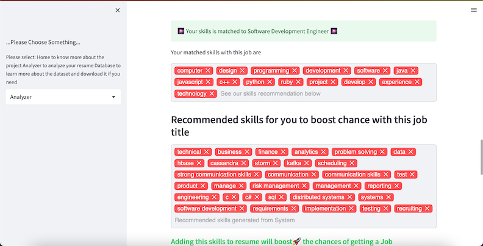
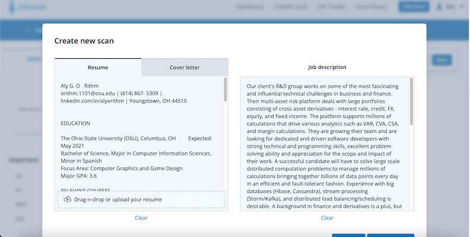
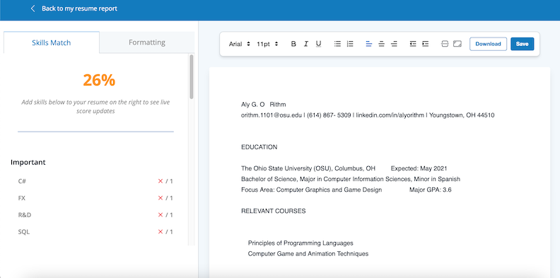
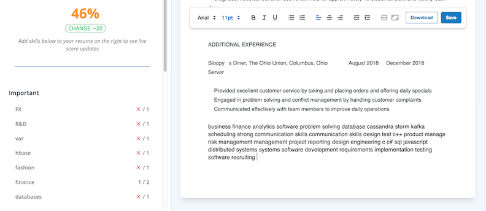

# Introduction

## Motivation

For the last two years, the world has faced an unprecedented event that directly contributed to the dramatic shifting in the tech job market, which is the pandemic - Covid 19. During the Covid 19 era, technical related occupations were envisioned to be the invincible profession as the pandemic forced humans to shift the practice of normal activity to online activity. The blooming of e-commerce, cryptocurrency, and e-learning, backed by the swift transformation from small startups to unicorn giants such as Zoom or Coinbase and the surge in market value of FAANG (abbreviation for Facebook, Appe, Amazon, Netflix and Google - the biggest fives technology corporation based on revenue and market share ), encouraged businesses to expand their technology sectors, subsequently allow numerous talents to join the field effortlessly [@harvard_business_review_2022]. However, this beautiful scenario doesn't last long, as the news about tech company of all size cutting their headcounts is on headlines every day. As the inflation index is increasing day by day, the amount of tech jobs that are cut is mounting at a much faster rate. One of the prominent consulting firms in the field of outplacement services, Challenger, Gray & Christmas, Inc, conducted a thorough analysis on the striking and unforeseen reduction of tech worker, which is illustrated by the graph below:


Based on the graph, the tech industry in 2021 experienced a low rate of layoffs, as the rate remained close to "0" throughout the year; however, by July of 2022, the amount of tech employees were cut off from the industry incline exponentially. This scenario signifies that the tech industry is on the verge of a comprehensive recruitment freeze[@june_2022], which directly affects the employment prospects of new graduates majoring in Computer Science and other tech related majors this year. Mark Zuckerberg , Meta CEO (formally known as Facebook) wrote, in a message to employees prior to the laying off 13% of its workforce, “At the start of Covid, the world rapidly moved online and the surge of e-commerce led to outsized revenue growth. Many people predicted this would be a permanent acceleration that would continue even after the pandemic…Unfortunately, this did not play out the way I expected.[@harvard_business_review_2022]” The controversial employment cut from Meta was the result of an unexpected, yet massive, loss of this company valuation. In 2021, Meta's valuation crested at $1 trillion, while in October 2022, the value of the parent company of Facebook, WhatsApp, and Instagram dropped to $300 billion [@picchi_2022]. In the past year months, in addition to Meta, Amazon, Microsoft, and Stripe have also announced layoffs at their respective companies. As these top-tier companies struggle to reduce costs by layoffs, they also have put a hold on new hires until further notice [@wamsley_2022]. The graph below from Market Watch depicting the rapid decline in the number of new tech jobs posted is evidence of the hiring moratorium.

![Decrease in new job posted[@han_2022]](images/hiring_freeze.png)

According to the image, the stagnation in recruiting began at the start of 2022 and decreased each month until it reached a record low in October when the article was published. This decrease is the exact opposite of the layoff rate depicted in Figure 1, which increases progressively from January to October. While the rate of layoffs is increasing daily, the number of newly posted jobs in the technology industry is decreasing, as shown in Figures 1 and 2. This means that it is difficult for recent graduates to enter the job market, as a group of experienced workers who were recently laid off are also entering the market to compete for the same positions. In addition to the rivalry between skilled tech workers and recent college graduates, the competition among tech students is at an all-time high. Indeed, the elite students who were supposed to have a separate application pool because they would only apply to the powerhouses and contend with those of the same caliber are now forced to migrate to the standard pool. This implies that it will be much more difficult for students with fewer skills, less experience, who graduated from a smaller institution, and who have other disadvantages to secure employment. 

Beside the sudden vulnerability of employment in the tech industry, this industry has always been known as one of the most competitive sectors due to its tremendous opportunities for growth and high salary. Since the recruiting procedures and its outcomes should remain confidential, the exploration of a published data set which can describe the competitiveness of the tech job market was nearly impossible. Thus, this paper will discuss an anonymous, yet accredited, job application journey across 18 months of a person with 3 years of experience in the tech industry.


The above graph asserts that this candidate applied to a total of 73 jobs and only 3 jobs resulted in a successful offer, indicating that his acceptance rate is 4.1%. Besides, this candidate is filtered out by most companies in the resume scanning phase, as his chance of landing the first interview is 21%. This example demonstrates that one of the biggest challenges candidates face in the job inquiry process is surpassing the resume round. However, in nowaday talent acquisition procedures, the resume scanning round is no longer performed by a human recruiter, it is scanned and filtered automatically by an all-rounded Human Resources assistant called Applicant Tracking System (ATS). Such a system analyzes resumes by detecting some certain keywords that were either preset by a recruiter or were derived from preset text mining algorithms. Hence, it is perplexing for candidates to surmount the system without the aid of any tools that help analyze the job post and their resume. Thus, this paper discuss the need and the formation of an application assistant tool called Lander, which is a text-mining based tool to help students with finding the most compatible job post based on their past experiences and interests as well as optimizing their resume by a keyword suggestion system.

## Introduction of Applicant Tracking System and its disadvantages to applicant

In the era of automation, the traditional hiring process slowly became deprecated, especially in a massive field such as technology. CompTIA, a prominent cybersecurity platform, claimed in their State of the Tech Workforce report that employers had posted nearly 4 million new tech positions on multiple job boards [@comptia_1]. While this number is lesser than the volume of job postings in the previous year, it is still significantly greater than the number of jobs in other fields. Hence, in order to deliver a hiring decision in efficiently, the Human Resources department tilted toward integrating Information Technology and Database Management into the hiring process[@mukherjee2014role]. Electronic Human Resources Management (e-HRM in short) is the first system that successfully incorporates cutting-edge technology into leveraging the performance of the human resources department. Applicant Tracking System is the later born of e-HRM, and it is solely in charge of the talent acquisition sector. An ATS is a computer software program that manages the hiring process. It does this by collecting and sorting thousands of resumes. Hiring managers can then screen candidates using the ATS, as well as track their progress through the hiring process. By automating the hiring process in this way, ATS system is believed to deliver accurate, cost effective and efficient hiring decisions.


Recruiting procedures normally consists of 7 stages, which are:

1. Applying: candidate applying to the position through multiple sources

2. Assessments and Testing: initial screening, contain but not limited to: resume screening, technical screening, and behavioral questionnaires. ATS has the role of hosting and regulating this step.

3. Application Review: recruiter review ATS’s qualified candidates

4. Interview: recruiter interview selected candidates, this round may consist of technical interview, behavioral interview, and panel interview.

5. Job offer: After initial screening and interview, the recruiter finalizes the hiring decision and extends an offer to successful candidates.

6. Pre-employment: this stage determines if candidates are eligible to work via background check, reference check, and finalize employment documentations.

7. Onboarding: successful candidates are lawfully able to work in the offered position, and will be integrated to the new position immediately

According to the description of recruiting stages, the initial screening stage incorporated ATS eliminates the largest number of applicants. Thus, candidates who want to excel the application process need to understand how ATS work. 

 

There are 4 basic steps to how an applicant tracking system works:

- Step 1: A job requisition enters into the ATS. This requisition includes information about the position, such as the job title, desired skills, and required experience.

- Step 2: The ATS then uses this information to create a profile for the ideal candidate.

- Step 3: As applicants submit their resumes, the ATS parses, sorts, and ranks them based on how well they match the profile.

- Step 4: Hiring managers then quickly identify the most qualified candidates and move them forward in the hiring process. 

In step 1, the type of job requisition that provides comprehensive information about the position is job description. By definition, the job description is “a list of job duties, responsibilities, reporting relationships, working conditions, and supervisory responsibilities ”.  In step 3, the ATS utilizes the application of Artificial Intelligence and Natural Language Processing to help recruiters filter out and rank qualified applicants. Whilst some perceive that ATS has tremendous benefits to the field of talent acquisitions, others believe that the algorithm-based filtration of ATS may have rejected numerous qualified candidates as their resume does not contain the key phrase that was identified as important for the role by the ATS. 

## Current State of the Art

Applicant Tracking System started to intergrate in the recruiting practice from the 1990s, replacing the piles of document on the table of recruiters and providing them a platform to keep track of applications and their status[@predictive_talent_acquisition_software]. The very first version of ATS acted solely as a database management system with a better queries for application tracking. In the 2000s, with the blooming of the internet, traditional recruiting strategies shifted to online-based, marking the birth of online application and job boards. Accordingly, the massive amount of online applicant urged the ATS to have two more applications: match candidate to the suitable job post and rank the candidates base on level of compatibility with the job. Josh Bersin asserted in his “HR Technology Disruptions for 2018” report that “hiring people is by far the most important thing companies do”, which emphasize the significant of having an effective and accurate recruiting procedure for the growing applicant pool. Hence, ATS is continuously growing in the field and slowly become an irreplaceble part of recruitment. 

![Current Value of Applicant Tracking System [@kbv_research_2022]](images/stateoftheart.png)

According to Research and Market, the Global Applicant Tracking System Market size is expected to reach $3.3 billion by 2027, rising at a market growth of 7.1% during the period of 2020 - 2027[@kbv_research_2022]. Such an increment signify that ATS is a growing practice, and the amount of companies utilizing ATS has expanded globally. Despite the exponential growth of ATS, the top ATS applications such as Workday, Taleo (Oracle), SuccessFactors, and Kenexa Brassing (IBM) secure their standing across Fortune 500 company[@kelly_2020], while the ranking of ATS tools usage across the market is quite different, in which Taleo, Greenhouse Software, and Homegrown clinch the top 3 standings[@ghosh_2022]. 

![Current Market Share of Applicant Tracking System [@ghosh_2022]](images/ATS_marketshare.png)


According to both of the ranking, Taleo is ranked as one of the most prominent ATS in the field of talent acquisition regardless of the size and market value of the company. Thus, this paper examine the internal of an ATS and how it work using Taleo as the case study.


### Taleo (Oracle)

Oracle's Taleo Cloud Service is a talent management solution designed to assist HR recruiters and management in attracting and maintaining key personnel in organizations of any size. The software offers the tools required to follow up on applicants and monitor recruiting data, which are accessible at any time. Facebook and Twitter are incorporated into the Taleo system. It also links with productivity tools such as Google and Microsoft Outlook. Taleo is a useful and effective method for onboarding new hires and includes a custom recruiting portal that stores new employee information. It also provides users with a dashboard for recruiters and recruiting managers to help identify any potential onboarding issues.

Key Taleo features include cost reductions (as Taleo data is managed by a cloud service) and social media and productivity integration (as Taleo is connected to major social media platforms). Together with Taleo's comprehensive ATS service, these key features such as applicant tracking, dashboards, and integration APIs enable recruiters to make effective recruiting decisions. Some companies use Taleo are: Starbucks, Nike, Nintendo, Tesla, United Airlines, etc..

Taleo streamlines the talent acquisition procedure by ranking and filtiring applicants using 4 methods [@hu_2022]:

- Method 1 - Tiered Scoring for Knockout Questions: Knockout questions are pass/fail questions that are commonly used in the application by recruiter to filter out candidate who doesn't meet some baseline requirement, such as "Do you need sponsorship now or in the future?", "Are you lawfully allowed to work in US without limitations?". Taleo allows recruiter to put in tier grading for every knockout questions and filter out candidates according to the requirement of the recruiter. 

- Method 2 - Bonus Points for Certain Resume Keywords: Recruiters can use Taleo to give applicants who include certain keywords in their resumes (such as those listed in the required skills or recommended skills sections of the job description) a higher score when shortlisting candidates. Taleo uses this supplementary scoring to rank the applicants who made it through the knock-out questions.

- Method 3 - Automatic Resume Scoring: Even if a recruiter chooses not to manually assign additional points to specific keywords, Taleo evaluates applications and resumes based on their content using a metric known as "Req Rank." Taleo analyzes the text of a candidate's application and resume and compares it to the posting's requirements. Recruiters will eliminate candidates who do not satisfy a minimum scoring threshold.

- Method 4 - Boolean search: Recruiters can use Taleo to conduct skill and keyword searches, as well as more complex Boolean searches employing the "and," "or," and "not" operators (among other modifiers) to narrow their results. When evaluating resumes, recruiters frequently seek candidates with the aforementioned competencies. 

## Goals of the Project

With the hiring freeze and the increase in demand for experienced workers in technology industry, the new graduate classes are facing the challenging of not being able to secure a job right after graduation. Moreover, the amount of graduate student who are struggle to find their suitable job title in the overwhelmingly massive job market has increased exponentially. Thus, the whole purpose of Lander is to become an automated resume coach which provide an open source, free, and user friendly tool for any candidate who are currently in the limbo of job searching by matching the candidate to the suitable job by calculating the similarity between the candidate resume and the job description, and helping candidate to identify certain keywords that they should include in their resume to pass the ATS resume scanning round. After the keywords identification process, user can incoporate those keyword into their resume in order to elevate their resume. Lander is certainly not trying to inspire candidate to manipulate the hiring process, it is only a method for candidate to determine and apply to their suitable job efficiently and successfully. 

As recruiter utilize ATS to increase the performance of their job, the candidate also have the right to apply Lander in their job application journey to increase the chance of getting into desired position. Moreover, the ATS system, if falls into wrong hand, may turn to a systematic bias in the process of making hiring decision as recruiter can modify the scoring or ranking system to make sure that candidate fit their narrative instead of matching the job requirement, so Lander can be a way for candidates to offset these hidden scheme for hiring if any. 

## Ethical Implications

Prior to discussing Methodology and Experiment, the author's initial concern about the tool's use is followed by a list of ethical implications. Consequently, the comprehensive discussion of the following ramifications will be contained in the conclusion later on in this paper.

1. Data collection issue

The database used for Lander is adopted from Kaggle, and this dataset is scraped from Dice.com, a job board website. Even though dice allows scraping and Kaggle provides open source dataset, this tool will use this database to support job seeker and may direct the user directly to the original job post, not to Dice.com, which may reduce the revenue of this job board website as Dice.com make money from website traffic. This may pose a problem that Lander is using Dice.com data to harm Dice.com itself.

2. Potential social issue

This tool helps job seeker to identify suitable jobs and leverage their resume using algorithms, posing a big question - Will ATS/recruiter discriminate against using this tool? If recruiter actually has an unfavorable look on candidate who utilize ATS-counter tool, then Lander will become a tool that is consider harmful to user instead of being helpful.

3. Potential misuse - unintended consequence 

As Lander intend to recommend people keywords that they should include in their resume in order to boost the chance of getting through the resume screening round. One critical question that this tool need to address later is: "Does this tool tell people to lie, as candidate may include the keyword that are not applied to them." In order to resolve this issue, Lander need to make a clear statement on how the tool should be use and that having only a good resume does not result in a job landing.

4. Information privacy

As an application that prompting resume and other private information from user, Lander is prone to have confidentiality problem. Hence, there is a need to make sure that the information of the user is secured in the Methodology section. 

# Related work

## The big picture of Applicant Tracking System and its advantages

Emerging into the talent acquisition industry from the 1990s, Applicant Tracking System has become an indispensable tool in the field of recruitment.  Human resources departments “have been the organizational business units most averse towards information technology (IT) for decades” (Laumer et al.) [@laumer2015] as the automation in a sector that requires human intervention is complicated to regulate. In a survey conducted by Gupta et al in late 2018 across recruiters about their opinion on the impact of technology on talent acquisition sector, the demonstration of the final result is as follow:  

Table: The survey on the impact of ATS on the performance of recruitment [@gupta]

| Criteria                                                                       | Agree | Disagree     | Neither      |
|--------------------------------------------------------------------------------|-------|--------------|--------------|
| With Technology, recruiting is potentially Better, Faster, and Cheaper         | 96%   | Not reported | Not reported |
| Technology enables the understanding of the longevity of the employees         | 50%   | Not reported | 39%          |
| Technology usage in hiring improves Hiring cost                                | 77%   | Not reported | Not reported |
| Technology usage in hiring improves ‘‘Quality of hire’’ metrics                | 79%   | Not reported | Not reported |
| Technology usage in hiring improves ‘‘Competency/skills gap analysis’’ metrics | 75%   | Not reported | Not reported |
| Technology usage in hiring improves ‘‘Professional development’’ metrics       | 73%   | Not reported | Not reported |
| Technology usages in hiring will miss significant candidates                   | 35%   | Not reported | 44%          |
| Technology usage in hiring improves the transparency to all stakeholders       | 65%   | Not reported | Not reported |


From the report, Applicant Tracking System does not only play an important role in increasing the performance metricts of recruitment process, it is also a potential solution to tackle one of the most controversial issue in the talent acquisition sector: the transparancy of hiring decision. The incorporation of technology in delivering hiring decision may help to reduce the biases in the process as the initial scanning is performed by machine with high level of accuracy. Most Applicant Tracking System software, such as Taleo, has a scoring system which quantify the similarity between a candidate profile and a job post and finalize the ranking of the whole pool of candidates in a short amount of time. Such a metric is supposed to be free of biases as human recruiter can't intervene the calculation of pure similarity point. 

The description of Applicant Tracking System within the above Introduction section is only about one of the numerous applications of ATS in recruitment - which is resume screening - the actual ATS software is a comprehensive tool which involved in every step in recruitment. Creating a job post automatically base on recruiter entry and posting said job post on multiple job board is the very first usage of ATS in the recruitment pipeline. Then, ATS also leverage the branding practice of a job post by governing the advertisement of such job on multiple platform. Besides, several administration duties are conducted effectively by ATS such as: collecting resume, keep track of application status and recruitment status, send email to candidates at different stages of recruitment process. 


![A typical ATS and its component [@koteswariuse]](images/ats_every_step.png)

In addition to the typical component that most ATS is having above, several ATS software has broaden the horizon of the involvement of it in the recruitment, for example: "Hirevue introduced AI-enabled technologies that will analyzing appearance and languages, how the applicant is answering for every question to identification of style of speaking, this mechanism will help to select right talent into the enterprise." [@nishad]. Such an advancement magnify the incorporation of ATS within the candidate screening procedure in which ATS can evaluate the candidate using the interview video as well, and it soon become significant. During the 2020-2021 recruitment cycle, due to the burden of the social distancing guidelines, several company had transformed their first interview round, with the intention to acquire more information from the candidate, to video recording in which candidate can record their responds for acquired questions and submit it to their application. Thus, on the stance of recruiters and human resources officers, the impact of ATS on their duties at this moment is far exceed the recurring limitations that it is holding.

## The problems of Applicant Tracking System

Even though the benefit of ATS is indisputable on the recruiter end, its limitations is detrimental to candidate, especially those who have insufficient knowledge and experience with ATS-driven job application procedures. These candidates are, but not limited to, new graduate candidates and senior candidates seeking for new job after a long period of time. The majority of potential disadvantages of ATS lies in the candidate screening process due to the complications of Machine Learning algorithms. 

### Methodology of candidate screening in ATS

ATS often time utilizes supervised learning as the hidden layer of candidate selection and candidate ranking.Supervised learning occurs when algorithms are loaded with instructional data and correct answers. The task of machine learning is to memorize the training databases and apply the gained knowledge, all based on real data. Supervised machine learning algorithms are described as learning functions $Y=f(X)$, where the tool based on AI makes predictions about the future (Y) and new variable input data (X) [Le, 2021]. In ATS, the training database can be the profile of successful candidate while the correct answer in this context is the compatible job title with such profile. The continuous feeding of candidate data to the tool will help it finalize the list of key skills for each job position. Then, these key words incorporate into the formation of job description or the candidate selection for a job position. 

### Harmful feedback loop of Supervised Learning

One of the most controverial issue of supervised learning is if the training data solely come from the past record, the predictions computed from such dataset may follow the pattern of the training data, which subsequently increase the level of bias in deliveration of predictions. The reason is supervised learning follows strictly the given record and unable to realize the possible mistake from the past database. Such a scenerio is labeled a harmful feedback loop, which "prevents the system from improving over time by removing the presence of unbiased data." [@soni_2022]

By definition, feedback loop is a prevalent practice in machine learning that uses the output of the process as the input of the same process to improve the performance of prediction over time. Once the profile of a successful candidate is added to the tool's historical hiring data, an Applicant Tracking System feedback loop is created. This data will be fed into the system so that the applicant tracking system (ATS) can identify suitable candidates based on the skillsets and other information of previously successful candidates. Despite the fact that feedback loops frequently improve the algorithm's performance and precision, if the historical data is biased, it may exacerbate the ongoing bias in the tech industry's recruiting process. Since the algorithms in ATS are mostly supervised learning, it is inevitable to retain harmful feedback loop. The notorious example of a harmful feedback loop in delivering hiring decision using automated recruitment assistance is Amazon in 2014. The giant in technology had developed a tool with a desire to identify the candidate in a large pool of candidate efficiently, which possessed the same concept with a typical ATS. Despite the promised prospect, the tool turned out to discriminate againts women candidates as the trained database was dominent by male candidate. In the database, which include the profile of successful candidates in Amazon for the last 10 years, the amount of male applicant were overwhemingly more than the female candidates, which give the tool a perception that male candidate is preferred, while resumes containing the word "women" are reserved for other type of occupations[@hamilton_2018]. 

### Inflexibility in ATS screening

Apart from unconcious biases from algorithms, ATS holds another challenges to job seekeer: The system is highly inflexible. ATS rank candidates based on how compatible they are to a job post, and the compatibility occured only if the resume consists of the exact key word that the ATS is looking for. Hence, candidate with decent skills and experience can still be filtered out if the wording is not aligned with ATS's preset paremeters [@rony_2020]. Apart from keywords, ATS is also reported to have problem with compiling different formats, fonts, and the majority of graphic. 


For example, ATS is unable to parse a resume correctly if the heading is worded slightly different to how ATS is programmed, or fail to identify the synonym of a certain keyword. Table 1 also suggests that nearly 80% recruiters either agree or having mixed feeling about the fact that the usages of technology like ATS in hiring process will cause company to miss significant candidates. 

## Approaches to resolve ATS issue on the stance of candidate

The research for an application that focus on improving candidate experience with ATS was challenging as ATS is a fairly new concept, and the majority of scholarly conducted articles on such topic are about the introduction of ATS and its impact on recruitment procedures. Thus, this paper will only examine two tools that imitate the work flow of an ATS to help job seekers overcome the limitations of ATS, which are: Resume Scan and Job Scan.

### Resume Scan

Resume Scan is a two-way tool with the purpose of enhancing the performance and experience of both recruiter and candidate by proposing a system that can handle Application Tracking and Career Prediction Model at the same time [@sippy_2021]. This tool is a research-based project, which is conducted by a group of undergraduate research student and their professor at the Thadomal Shahani Engineering College in India. The motivation for their research is that 60% of engineering students remain uncertain about their career prospect by the time of graduation, and they also want to provide an inexpensive recruitment tool for recruiters.

#### Methodology

1. Application Tracking Approach


![Applicant Tracking Pipeline [@sippy_2021]](images/forrecruiter.png)

In the Application Tracking end of the tool, Resume Scan evaluates the compatibility of a candidate to a job by comparing the skills mentioned in the candidate resume to the requirements of the company. The system identifies candidate skills by extracting the relevant information from the resume and store in a list, whilst prompting the company requirements from the recruiter for such a position and store in the other list. Finally, Resume Scan compute the matching percentage by purely calculating the similarity between the two lists of keyword and ranks the candidates based on this metric.


2. Career Prediction Model Approach

![Career Prediction Model Pipeline [@sippy_2021]](images/forstudent.png)

In order to implement the Career Prediction Model, Resume Scan first classifies the possible skills of candidates into different categories, i.e: Technical Skills, Management skills, Data Science, etc. Then, the tool extracts candidate skills from their actual resume and compares the skills list with the pre-stored skills in different domains. Finally, the tool will return the domain of career with the highest matching percentage to the user. 

#### Limitation

It is challenging to evaluate the efficacy of the system because this tool is not an open source project which is available to examine by any user. Hence, the limitation assessment for ResumeScan stems solely from the design of this tool's methodology. This tool's Application Tracking Approach maps candidate resume keywords to recruiter-entered keywords. This strategy may incorporate bias into the hiring process because it permits the recruiter to exclude candidates based on their own criteria. To provide career guidance, the Career Prediction Model Pipeline can only classify people's abilities into Technical, Management, and Data Science categories at this time. While the approach of classifying students' skills into distinct field is advantageous, the lack of more specific categories may result in an oversimplification of the position for which a student should apply. How does a candidate know, for example, whether to apply for web development, quality assurance, UI/UX developer, etc., if they are matched to the Technical sector?

### Job Scan

Unlike Resume Scan, Job Scan is an actual published ATS-counter application that has been used by more than 1 million job hunters. James Hu, the founder of JobScan, created the tool due to his own struggle with applying to job in the age of ATS-driven screening. The only targeted user of Job Scan is job seeker, in which the tool will help them to leverage their profiles from the inside out by polishing their resume, cover letter, LinkedIn profiles, along with educating user about ATS using a wide range of resourseful articles. 

#### Methodology

Even though Job Scan doesn't publish a paper to describe their workflow and there has yet been a scholarly published paper on this tool, this application has been recommended by numerous experienced job coaches. Jobscan giving resume matching score by conducting a comprehensive analysis of candidate's hard skills, education, job title, soft skills, other keywords [@steph_2022]. Other metrics such as word count, words to avoid, section headings, file type, format, and seniority level match is also incorporated in the Scan Report.


From the result of the Keyword Comparison section, the matching calculation may weight the score using term frequency in which the matches with the keywords that have higher frequency in the job description affect the overall score more than keywords with lower frequency. Besides, Jobscan also incorporates a tag called predicted skills. This section utilizes supervised learning by using the database of Jobscan on the job post with the same job title and compute some predicted skills that apply to the role but are not on the specific job post. Catering to beat specific ATS software is another specialty of Jobscan. Since different ATS software has their own strengths and weaknesses, Jobscan scrutinizes the most used software such as Taleo, Workday, iCIMS, etc. and provides specific advice to candidates when facing each software. For example, a tip from Jobscan to beat iCIMS is: “iCIMS does not recognize different tenses, abbreviations, or acronyms of skills and keywords. Tailor your resume keywords to be an exact match to what is found in the job description.” [@steph_2022]

#### Limitations

Despite the tremendous benefit of Jobscan, Steph Cartwritght, a Job Search Strategist and Certified Resume Writer, asserted that this applications holds several drawbacks that job seeker should keep in mind when analyzing their Scan Report [@steph_2022], including:

- Too much emphasize on matching score: The scanned score is based on the keyword matching with keywords identified by Jobscan, while the list of keyword that ATS use may be different. Thus, the final score concluded by this tool may not reflect accurately on whether the candidate can land the job or not.

- May include buzzwords such as passionate, encouraging, impact, etc. in the important keywords section - this can be a problem with keyword extraction algorithms. The reason is the keyword attraction algorithms of ATS may only include nouns or proper nouns instead of a complete phrase with adjective plus nouns.

- Some redundant features for monetization: Steph claimed that some Jobscan feature such as LinkedIn optimization and Cover Letter optimization are unnecessary as ATS will not scan cover letter, unlike what Jobscan claimed, and LinkedIn profile should remain simple and personalized as much as possible.

After evaluating two distinct tools designed to solve the Applicant Tracking System algorithm, one of which is a student research project and the other of which is a successful business in the field, a number of drawbacks are identified. The issue with Resume Scan is the lack of sufficient data to automate the keyword extraction processes. In addition, the lack of detailed position information can be remedied by having an actual data set that includes job titles and job requirements to correlate the job title to a set of keywords, thereby matching the user to an actual job title as opposed to a general field of work. On the other hand, despite the fact that JobScan has been demonstrated to be effective by hiring coaches, the tool is quite expensive and includes an excessive of monetized features to maximize its revenue. Consequently, it is essential to develop a free tool that provides both constructive career advice and keyword recommendations.

# Method of approach

## Approach proposal and reasoning

While one of the most prominent Resume Optimization tools, Jobscan, asserts that their service increases interview recall probability by 300 percent, the contentious issue with such a tool is: How about the following step? Getting an interview is only the first step in a lengthy employment process. Other rounds that are similarly challenging, such as aptitude tests, technical assessments, and behavioral interviews, await the candidate. Consequently, a resume keyword optimizer tool should not only consider how to create a resume that is as outstanding as possible, but it should also direct the user to a job that matches their skills. With a resume that contains all relevant keywords, a JobScan client can become the ideal candidate for any position. However, since JobScan solely suggests candidates include more keywords and skills that a recruiter wants from them for a specific title, candidates may have a deceptive belief that including more keywords on their resume will help them land a job. In reality, a strong resume, regardless of how closely it matches the job description in terms of percentage, can only increase a candidate's chances of landing an interview, not the job itself. To increase the likelihood of obtaining a job, it is essential to match the candidate with a job title that is compatible with their prior education and experience. Thus, the pipeline of Lander consists of two main steps:

1. Match candidates to a cluster of job title in a job banks using Kmean prediction: clusters of job titles are determined by the similarity in the keyword and skills highlighted in their job description.

2. Match candidates to top jobs within the cluster and give resume optimization suggestions

This method draws a big picture of job hunting for candidate, in which their desire job title may not be suitable to their strengths, but other job title does. After a thorough assessment of several existed platforms which dedicate to supporting candidate in resume optimizing and career recommendating, one of the other most significant problems with these platforms is monetization, as these platforms modifying the scanning output in order to lure client to upgrade their plan. Lander is an all-in-one job-seeking assistant which is, and will always, remains free and accessible for anyone. The heart of this platform is the evaluation of job fit using two metrics: Spacy Phrase Matching Score and Cosine Similarity Score. 

## System Design


Lander workflow consists of three stages, including

- Data Processing: This stage performs data cleansing on job bank to ensure all entries are consistent. Then the job title will be cluster into groups based on the relevancy in skills requirement accross jobs. Jobs titles with a high similarity of desired skills will be group together. For example, front-end engineer titles across company should belong to a similar cluster.

- Scoring System: This stage calculates the matching score between a resume and every job in one cluster using Cosine Similarity to narrow down the search and then using Phrase Matching technique to compute skill matching percentage

- Reccommendation System: This stage sorts the matching score across one cluster and return the top 5 of each metrics, then return the important phrase in a chosen job which has yet been mentioned in the resume.


### Data Preparation: 

#### Preparing data for resume scanning

1. Data retrieving

The initial stage in developing an automated job scanning tool is gathering information, particularly real resumes and example job descriptions from various technical occupations. This study makes use of a job bank with 22,000 entries that Kaggle collected from Dice.com, a real job dashboard [@promptcloud_2017]. This job bank has 12 data columns, each of which represents a different piece of essential job post information. For testing purposes, this project also makes use of a collection of 3 resumes retrieved from the author and an open source career document from Ohio University and Carnegie Mellon University. These resumes correlate to a similar level of seniority in the tech industry, which is entry level. All resumes are in PDF format, so PyPDF2 is used to extract the text from resumes. The Panda library serves as the primary tool for extracting and storing the database for job banks. The first step is to divide the dataframe into a sub-dataframe that only contains the three pieces of information that are crucial for calculation: "Job Title," "Job Description," and "Skills."

2. Data cleaning

After the extracted data is stored into the data frame, the next essential step is to abolish unnecessary component from the data. `re` library, abbreviation of regular expression, is the library mainly use for finding a string or a set of string using special regex pattern; such library is useful in locating special punctuation, new line, other meaningless text in the document and replace them with white space. In this case, all redundant information is ommited from the important dataframe, including empty cell, or `Skills` cell with a value of "See Job Description", "See Below",...

Example of one cleansing step

```python
  for token in tokens:
    if re.search("^[A-Za-z0-9+_-]*$", token):
      filtered_tokens.append(token)
  stems = [stemmer.stem(t) for t in filtered_tokens]
  return stems, filtered_tokens

```

The above code snippet performs data cleansing in the skills and job description column, in which only tokens that consists of actual skills information without special symbol can stay in the data set. This usage of regular expression is important as Then, the skills and job description are stemmized, which is the process of reducing a word to its word stem that affixes to suffixes and prefixes or the roots. This action benefits the calculation process later on, as it improve the accuracy of cosine similarity calculation.

Additionally, the data cleansing procedure of skill set is more intense as the skills matching has to be an exact match. The important keyword is filtered out from the skills set as follow:

```python

for entity in skill:
      if re.search("^[a-zA-Z0-9_ ][a-zA-Z0-9_ ]*[a-zA-Z0-9_]$", entity) 
      and len(entity.split(" ")) < 3:
        skills_cleaned.append(entity)
```

This regular expression rule ensure that the skills extracted from the skill column in an actual skill, not a long phrase of requirement as it only pass the word that start with an actual letter and contain no more than three words in a phrase.

3. Data processing and final checking

In this stage, the data frame will become a simple and consistent format for further advanced analysis. The process include 3 steps:

-  Word tokenization: turn long text in resume and job description into token (single word) to make the analyzing process easier using Scipy

- Stop words: Remove words that are meaningless for resume scanning and job description processing but tends to appear a lot. NLTK library have a built-in list of stop words that was utilized in this project, for example, some word appear with high volume that may alter the cosine similarity score such as: "and", "or", "of", etc,.. will be omited from the database.

- Lemmatization: Globalizing the input entry by returning the text into its meaningful base form.

After this stage, a data frame called `data_eval` is formed, which consists of pre-processed texts for evaluations. 

#### Comprehensive skill extraction (Alternative approach to data preparation after testing)

After trials of clustering jobs based on given skills on the input job data, an unexpected inconsistency between number of job within each clusters repeatedly occured regardless of any normalization attemp on the database. At that time, there were some cluster having 6000+ entries while some other cluster only have roughly 100 entries. Even though a thorough investigation on such an behavior has not been conducted due to the complication level of clustering jobs by hand to test the accuracy of the cluster output, the central of this issue can only be either the algorithm or the input data. As sklearn clustering algorithm is highly accurate, the final suspect narrowed down to the input data, specifically the    `skills`  column in this case as the clustering procedure is based on `skills` column . 

1. Inspection of the skills column

Prior to any data cleansing and normalization, the whole input data holding job information is as follow:


According to the above dataset, the variation in number of skills in `skills` column is tremendous and certainly missing skills related to the job. For example, in row 2, for job title of `Automation Test Engineer`, the only skill listed in the skills column is `See Below`, which does not actually providing the skill needed for a Automation Tester. Hence, it is imperative to have a solution to fill the skills column with relavant skills according to the job description and remove millacenous information such as *_See below_*, *_See job description_*, etc. The reason is the input for clustering algorithm are skills in skills column, making job having similar data in skills columns mapped together in a cluster. Hence, an adaquate amount of skills or incorrect skills in each row contributes to the false negative clustering output. 

2. Comprehensive skill extraction

Based on definition, job description is a formal account of an employee's responsibilities, hence, job description contains the comprehensive list of comprehensive skills that the job requested. However, job description is a form of formal writing, in which it may not list out the skills but bury them somewhere between the lines. Hence, the appropriate place to extract relevant skills in a job is in job description. 

The work flow of skills extraction is as follow:


Initially, the skills in every profession in the dataset are combined with an external list of technical skills from a dataset on Kaggle to build a list of skills for all technical-related occupations. Following that, any redundant terms in this list are reduced to a single instance, and unrelated terms such as "See below", "See job description", etc. are eliminated. 

```python
def keyword_extracting(text_jd, text_skill):
    # Generate matcher pattern by extracting keywords from job description
    matcher = PhraseMatcher(master.vocab)
    patterns = [master.make_doc(k) for k in text_skill]
    matcher.add("Spec", patterns) 

    # Matching the keyword in job description with resume
    text_jd = master(text_jd)
    matches = matcher(text_jd)

    match_skill = []
    for match_id, start, end in matches:
        kw = text_jd[start:end]
        if kw.text not in match_skill:
          match_skill.append(kw.text)

    return match_skill
```

After the formation of the list of skills, the skills related to each job is extracted from the job description by using the Phrase Matcher function in Spacy. Matcher is a rule-matching engine in spaCy that works with tokens in the same way as regular expressions and Phrase Matching is a rule-based phrase matcher. In this case, every skill in the skill list is transformed into a search pattern (or search token), and job description is the document where the searching is concluded. At the end of this function, a list of skills from job description is successfully extracted and store in a list, which replaces the original skill list in the dataset.

Following the creation of a list of skills, spacy Phrase Matcher function is used to extract the abilities relevant to each job from the job description. Phrase Matching is a rule-based phrase matcher, in which matcher is a rule-matching engine in spaCy that operates with tokens in a manner similar to regular expressions. In this instance, each skill on the skill list is converted into a search pattern (or search token), and the job description serves as the final destination for the search. This function successfully extracts a list of skills from the job description, stores it in a list, and replaces the dataset's original skill list.

3. Final dataset with extracted skills

After the comprehensive skills extraction procedure, which took the total of 7000+ minutes due to the time complexity of searching through 27000 skill keywords and 22000 job description in total, the final dataset with successfully extracted skills is as follow:


The results show that unrelated skills were effectively eliminated, and the newly computed list of related skills successfully replaced the original list. For instance, the skills associated with the "Automation Test Engineer" job have been correctly computed, and the distribution of number of skills across job titles is noticeably more even than in the original dataset. Also, because the variance in the number of entries in each cluster is considerably closer, this dataset enhances the effectiveness of the clustering algorithm. A cluster might have up to 1400 jobs, but it can also have as little as 300.


4. Impact of new dataset on data preparation:

As the remaining sprint of the project is build on this dataset instead of the original one, the data preparations steps in the above section remain essential but some step can be skipped. The data cleaning technique in the second phase of data preparation can be bypassed because it only takes care of eliminating the "Skills" field with a value of "See Job Description," "See Below,"...; however, the new dataset is already responsible for this step. As a result, the new dataset increases both the tool's time complexity and accuracy of the clustering algorithm.

#### K-Mean Clustering

After the `data_eval` data frame is formed, the 22 000 entries in the job banks will be categorized into different group using K-Mean cluster algorithm. By definition, K-means algorithm automatically group data points in to predefined k amount of clusters by ensuring the mean distance of every points each cluster to the centroid is minimum. The first step of this algorithm is selecting the number of cluster that this project want to identify, which is 26 from the result of Elbow Analysis; hence, we have k = 26. 

As the K-Cluster model relies on the quantified data points to determine centroid and its members, the text in `Skills` section need to turn to vector prior to the clusteration. 

```python
data_forfit = data_eval['skills']
tfidf_vectorizer = TfidfVectorizer(sublinear_tf = True, min_df = 0.001, 
                                  use_idf=True, stop_words= 'english')
tfidf_matrix = tfidf_vectorizer.fit_transform(data_forfit)
```
Instead of transforming skills text into regular vector, `TF-IDF Vectorizer` allows the vector value represent the weight of the text in the database and help normalized the matrix later on. After the conversion, the cluster procedures is performed.

The clustering of jobs bases on skills is important as this act will allocate the candidate into a cluster of job title, as well as improving the efficiency of matching calculation for Lander. The resume text is supplied into the model, and Kmean Prediction matches the resume to a specific cluster once the 22000 items are separated into 26 clusters. When that happens, only that one and not the entire dataframe will be used to calculate the matching score.

```python
km = KMeans(n_clusters=num_clusters)

km.fit(tfidf_matrix)

clusters = km.predict(tfidf_matrix)

```


The figure up top displays a sample Lander cluster along with the job titles that go with it. For instance, the top keywords in Cluster 14 are peoplesoft, salesforce, design, and cloud; hence, a job title that prioritizes creativity or involves a significant amount of human interaction should match this Cluster. Business Solution Architect and Open Stack Engineer are two job titles in the job bank that are classified into this cluster based on the algorithms and are quite near to the prediction.


### Matching Metrics

The résumé is first clustered, and then additional matching is done using two metrics: phrase matching and cosine similarity. The expected outcomes after performing these two matching method is retrieving top 5 jobs with highest phrase matching score to user input resume.

#### Scoring bases on Similarity

After obtaining the clean data set, the first advance analyzer the evaluation of document similarity between the Job Description document and the resume input using Cosine similarity algorithm in scikitlearn library. This procedure will first turn each document into vector and this vector will be visualize using vector space.

Specifically in this case, Cosine similarity between a resume (R) and a job description (JD) is calculated by:

$$
\text{Cosine similarity {(R, JD)}} = \frac{(R)(JD)}{|JD|*|R|}
$$

In the vector space, the closer the cosine value to 1, the smaller the angle between vector and x-axis, the higher correlation between two documents. Even though, the theoretical explanation of Cosine document similarity seems complicated, this paper will not manually implement every single step of this concept. Instead, this paper optimizes the use of Sklearn, or Sckit-learn, which is a library that include a tremendous amount of essential Machine learning tools, inluding cosine similarity algorithm.

After the solution is identified, it is then turned to actual function as follow:

```python
def similarity_caculator(text_resume, text_jd):
    text_list = [text_resume, text_jd]
    cv = CountVectorizer()
    count_vector = cv.fit_transform(text_list)
    matchPercentage = cosine_similarity(count_vector)[0][1]*100
    matchPercentage = round(matchPercentage,2)
    return matchPercentage
```

The first stage in the pipeline for matching resumes to top job titles is the computation of the cosine similarity score. The top 100 job titles with the highest score are retrieved and are saved in a new dataframe named `match df` after the cosine similarity score between the resume and job description is calculated for each job title. The Phrase Matching tool then uses this dataframe to determine the top 5 job titles. `Streamlit setup.py` contains the code for returning actual ranking of cosine similarity scores. 

#### Scoring bases on Phrase Matching

Matcher is a rule-matching engine in `spaCy` that works with tokens in the same way as regular expressions and Phrase Matching is a rule-based phrase matcher.  The rules can reference token annotations. This tool helps match extensive terminology collections, which is the key phrase of the resume and job description. The source code for matching is provided below:

```python
def keyword_matching(text_resume, skill):
    # Generate matcher pattern by extracting keywords from job description
    matcher = PhraseMatcher(master.vocab)
    patterns = [master(k) for k in skill]
    matcher.add("Skill pattern", patterns) 

    # Matching the keyword in job description with resume
    text_resume = master(text_resume)
    matches = matcher(text_resume)
    match_keywords = []

    for match_id, start, end in matches:
      kw = text_resume[start:end]
      if kw.text not in match_keywords:
        match_keywords.append(kw.text)
   

    return match_keywords
```

The goal of this operation is to return a list of similar terms across two texts, hence this code snippet proposes a similar solution to the skill extraction procedure described before. The parameters for this `keyword matching` function in this instance are the content of the user's résumé and a list of skills associated with a job title. Every ability on the list of skills serves as the basis for the keyword-matching pattern. Matcher model in spaCy then searches the input resume for all similar phrases using this pattern. Following the discovery of all related key phrases, the matching percentage is determined by:


$$
\text{matching percentage} = (\frac{\text{Amount of keyword matched}}{\text{Amount of keyword in Job Description}}) * 100
$$             


The final data frame called `match_df` will then include the matching percentage scores as a new column labeled "Matching Percentage." The top five job titles with the greatest percentage score are then selected from the vast data set and subjected to additional scrutiny. 'Streamlit setup.py' contains the actual calculation and ranking of matching scores.

### Keyword suggestions

Following the identification of the top 5 job titles, the tool will compare each of the 5 job titles' skill lists to the content of the resume to find the list of every term that is deemed to be important in job description but has yet been included in resume, allowing the user to make the necessary changes. The Phrase Matching function also add one column to the final matching dataframe, which contains list of matched key phrases, makes it easy to do a reverse search for missing keywords. As a result, the reverse search is performed by comparing the list of matched key phrase and the list of all skills in a job title. 

## Challenge and Solution: Time complexity of Lander

One of this tool's main problems after the tool pipeline is finished is how time-consuming it is. This tool's fundamental function is text mining over large datasets, an already expensive process. Moreover, the skill search must be an absolute match, and any text normalization, such as lemmatization or stemmatization, is inappropriate because it could alter the skill's intended meaning. As a result, it is anticipated that this tool's initial time complexity will be near to Big O exponential. The first time the program was used, Phrase Matching and Cosine Similarity were run independently and unconnected, and it took a total of about 20 minutes to generate the final list of missing skills.

The time complexity is then reduced by disabling unwanted pipeline while loading the english module from spacy, such as `ner`, `tagger`, and `parser`. This action itself helps accelerate the process to 13 minutes. By itself, this operation speeds up the procedure to 13 minutes. Cosine Similarity and Phrase Matching are consequently combined to change the matching workflow. Given that Phrase Matching is an absolute match but Cosine Similarity is a vectorized computation, the latter is much faster compare to the former. Hence, Cosine Similarity is utilized to reduce the search to 100 job titles before Phrase Matching is performed on those 100 job titles alone as opposed to the entire cluster. The last action is adding the `@st.cache` decoration to streamlit script since, despite the tool's performance on Google Colab with GPU power, streamlit is slow because it must be re executed each time. After all the steps above have been taken, the current time spent using the web interface is 1 minute, 42 seconds. 

### Result

Lander is currently live in a public repository at [Link to Lander](https://github.com/Mai1902/landing) and is unable to support an actual web interface at this moment. Thus, in order to use the tool, user need to clone the repository into their device using:

```
git clone git@github.com:Mai1902/landing.git
```

Then, all dependencies used for this project can be install by:

```
poetry install
```

Once all dependencies is downloaded, user can run the tool by: 

```
streamlit run streamlit_setup.py
```

The command will lead user to a pop up window where they can upload their resume and receive job titles recommendation and keywords recommendation.


# Experiments

To reinterate, the optimal purpose of this tool is to help students or those who wish to pass through the resume scanning round in the age of technology-driven recruiting. The tool outcome returns a list of keyword suggestion that if user include these keywords in there resume, their chance of getting pass the initial resume screening is higher. It is best to verify the matching score difference for a resume before and after utilizing Lander using an ATS software to see if such an increment is occurring or not. Nevertheless, after doing extensive research on various ATS software, it became clear that students would not be able to afford their service because ATS is a blackbox program that discourages other people from trying to conduct research. No matter how small the size of an ATS software may be, only legitimate businesses are allowed to buy and utilize it. This choice is comprehensible given that ATS is a comprehensive recruiting site that assists with storing candidate data, sending out announcements, monitoring the recruitment process, etc. in addition to being a resume scanner.

As ATS cannot be utilized for experimental purposes, utilizing alternative software that mimics the ATS scanning technique and generates some form of matching score for further quantitative evaluation is the other proper resort. Hence, Jobscan, which was extensively discussed in Chapter 2, will be used to evaluate Lander's accuracy. The reasons behind Job Scan is the ideal choice in this circumstance is this software has more than 1 million job seekers as clients, it is also an actual publicized ATS-counter tool, which has been acknowledged publically by job hunt coach as one of the useful apps to counter ATS algorithm.. According to Jobscan, clients generally see a 30% improvement in their own resume scanning round passing rate. Furthermore, Chapter 2 revealed that Job Scan is designed to outperform particular ATS programs because they are aware of a secret layer of real ATS products. So, in this scenario, Lander can be tested using Job Scan [@jobscan_2023].

Job Scan's main work flow is to take in the resume and job description, predict the job title from the job description, and return a list of skills highlighted in the job description and in jobs with similar job titles. It will then compare this list of skills to the resume and calculate the score based on the number of matched skills. The final JobScan score consists of resume formatting, skills matching, and searchability - which represents the ability of this resume to appear in recruiter searches. The component of searchability scoring is determined by whether personal information is mentioned clearly, whether work history includes the searched job title, and suitability with the job, which is calculated by matching keywords score.

## Experimental Design

### Primary experiment: Does Lander actually boost matching score?

One of the most important metric to evaluate the efficiency of Lander is if the addition of suggested keyword actually improve matching score of a resume to a job or not.  In order to achieve so, the experiment will run through 15 distinct trials employing 3 different resume, each with its own specialization. The three resumes are as follows: the author's resume, which emphasizes management and analyst skills; a sample resume from Ohio University with a focus on computer graphics and game design; and a sample resume from Carnegie Mellon with a focus on UI/UX design. The primary resume showcased in this paper is the sample resume from Ohio University with a focus on computer graphics and game design.


The first glance at this resume, it is belong to a college student who has yet have any work experience in the industry. Hence, the seniority of job this person is looking for should be Junior. This student also has a lot of skills related to software development such as Java, JavaScript, C, C++, HTML, etc, .. so the job matched to this person is likely to be a general job that has a long list of requirement. 

The experiment procedure include three stages in total, which is described by the pipeline below:


Initially, the resume will be run through Lander to obtain top 5 job title with highest matching score along with skill keywords suggestion and job description for each of the job title. The output of each job match includes three component: matched skills, missing skills, and job description for the job. The snippet of the matching report for one job position is as follow: 




Take a look at the missing skills and matching skills section, communication belong to matched skills section while `strong communication skills`, `communication skills` are listed in the missing skills section. 
This demonstrates that candidates frequently overlook the phrases in job descriptions and believe that including a keyword that describe the main skill in the resume already help them to pass the ATS scanning if the machine is looking for that skill. In reality, ATS is very likely to look for exact matches only, and since job description emphasize that `strong communication skills` is needed, mentioning `communication` only may lead to their unfortunate rejection. Hence, Lander will assist candidates in determining which terms they should include in their resume. Specifically, the student in this example, as the phrase mentioning communication in their resume is *"Increased intercultural fluency by interacting daily with international students to work through communication challenge"*. This sentence demonstrates that the student has excellent communication skills, as evidenced by their ability to participate in difficult conversations involving multiple cultures.

Job Scan is used to calculate the initial matching score between the resume and the job description after obtaining the job description from the matching output above. The first step is to create a new scan in Job Scan using the provided resume and job description, and then display the score by clicking the 'Power Editing' button. The following are the results of the mentioned steps:





Subsequently, the suggested keyword will be added to the resume and the change in score is observed:



The overall matching score has increased by 20% between the scores obtained before and after the resume's inclusion of Lander's suggester keyphrase. This resume's matching procedure will be repeated with 4 further jobs and the whole process will be repeated with 2 additional resumes, bringing the total number of experiments to 15. 

### Secondary experiment: Examining clusters

Clustering procedure is the initial matching step in Lander, thus, it is also vital to make sure that jobs in a cluster are actually related to each other and belong to one field of job.  In order to explore the given question, this paper plot out the top 5 keywords in each cluster with job mapped to such cluster and evaluate if those keyword are genuinely connected to job titles or not. 'Seaborn' is in charge of plotting the frequency of the keywords in each cluster, along with a list of the positions held in each cluster. This data will be displayed on Lander main website if user choose `Database` -> `Cluster Display` section.

## Evaluation

### Primary experiment:

After 15 trials, the initial score, after score and changing score in each trial is recorded by the following table:

Table: Experiment Result Data

 Trial  | Score before editing | Score after editing| Score change| Resume |
|----------|-------------------|--------------------|--------------|--------|
| 1  | 8%   | 39% | +31 |1|
| 2| 14%   | 41% | +27          |1 |
| 3 | 24%   | 46% | +22 |1 |
| 4 | 12%   | 35%| +23|1 |
| 5 | 31%   | 54% | +23 |1 |
| 6| 24%   | 53% | +29 |2 |
| 7| 18%   | 45% | +27       |2 |
| 8| 25%   | 47% | +22|2 |
| 9| 26%   | 46%| +20   |2 |
| 10 | 13%   | 36% | +23|2 |
| 11 | 35%   | 59% | +24 |3 |
| 12 | 14%   | 40% |+26|3 |
| 13| 26%   | 51% | +25 |3 |
| 14| 19%   | 56% | +37 |3 |
| 15| 21%   | 54%| +33 |3 |
|Average| 21.3%    | 47.2%   | +25.9  |

According to the table above, the average increase in matching score before and after using Lander is 25.9%. This increase in matching score vary based on the type of matched jobs. Resume 3 are only mapped into UI/UX or frontend design job and yield the average increase of 29%, while Resume 2 are mapped into developer jobs and only yield the average increase of 23.6%. This may infer that the skills set in UI/UX may be easier to navigate compare to a developer position. The other reason can be even though the student in sample resume 2 possesses a lot of technical skills, this student has yet have any other experience to work in a technical related position yet. Thus, this student may lacking some soft skills and technical skills which can only be obtain from a job setting, which may make their score harder to be increased.

As explained in chapter 2, the main principal of score computation in JobScan is through keywords matching, meaning the software put a big emphasis on keyword. Hence, the increment in matching score in JobScan after using Lander show that Lander can actually identify meaningful keywords that should be include in the resume. 

The graph representing the change in score is as follow: 


The red column represents score after using Lander and blue column represents score before using Lander, with yellow line represent the fluctuation in the change in score. The gragh asserts that the score after using Lander is always higher than the score before, which is the evidence that the usage of Lander actually increase the matching score. The yellow line is higher across resume 3 compare to resume 2 is evidence for different type of job may produce different changes in score.

### Cluster Examination

There are 26 clusters in total, this paper will only examine cluster 0 to model the accuracy of the clustering procedure.


According to the plot of cluster 0, Frontend job titles are connected to the list of hightlighted keywords such as: javascript, web, angular, css. These keywords directly related to Frontend as they are all web and frontend dominant framework. As the keywords and the type of jobs are directly related to each other, it is safe to conclude that the clustering procedure successfully group related jobs with each other along with relevant skill.

## Threats to Validity

Despite the fact that Job Scan has been advertised as software that mimics ATS pipelines to perform score matching algorithms, no scholarly published research has been discussed about the similarities between Job Scan and other ATS software. Actual ATS software, such as Taleo, can perform skill searches based on recruiter input or the skills of previous successful candidates in that company. Job Scan does not have historical data like ATS software; instead, it obtains a list of skills from people who work for the position in general. Thus, using Job Scan to validate implies that the uniqueness of one enterprise may be overlooked.

Furthermore, JobScan may increase matching score out of context, as evidenced by the trial, where matching score increased despite the suggested keywords being added at the end of the resume and not connecting to any sentence at all. This is likely to be the case in actual ATS software as well. However, if this is true, this resume will not make it through the round in which a human recruiter actually reads their resume.

The other threats to validity is Job Scan based their score on the frequency of keywords that appearing in the resume. This means that if a candidate wants to raise their score on Job Scan as high as possible, they must include the skill in their resume for the same amount of time that it is listed in the job description. However, since the actual procedures behind ATS software are unknown, it is difficult to determine whether the scoring system of ATS is also dependent on the frequency of keyword appearance or not. This unknown feature of ATS threatens to undermine the validity of the Lander experiment result based on Job Scan.

# Conclusion

## Summary of Results

### Comprehensive dataset on technology related skills

In this project, one of the most prominent outcome is the extracted skills set of every technology related work. This dataset can be important for other text mining project regarding occupational skills in general and technological skills on particular. One may used this list to build predictions model on finding list of skills in a job given only job title or predicting the changes in skills for each job title across a period of time. 

### Some scheme to improve time complexity in text mining task

Due to the large amount of text that this project has to processed, time expensive procedures is inevitable. One of the biggest challenge this project has to overcome was the massive time complexity. However, after trials of failure, several scheme to help resolve time complexity issue is as follow:

- Pre process the input dataset by performing every static procedures such as word extraction, stemming, lemmatizing, tokenizing and store it in the input data prior to actual procedure.

- The Phrase Matcher algorithms of spacy is exponentially faster than finding term using regex rules-based.

- It is true that Spacy is faster than NLTK in most of the case, but it only occurs if unnecessary pipelines to the procedures are disabled when loading the  `en_core_web_sm` model, if not, this model will perform every single pipeline and ended up take longer time compare to the same function using NLTK.

- Cosine Similarity function in NLTK is exponentially faster compare to similarity function in spacy if perform on text that lemmatization is not important. The reason is similarity function in spacy perform lemmatization no matter what, and this procedure take most of the time in the function.

- Streamlit is very slow, especially if some beauty special effect is added. It is important to add `st.cache` decoration to expensive operation to prevent streamlit rerun it everytime. 

### Lander outcomes

Based on the experiment, it is logical to conclude that using Lander will help user to increase the matching score in various job titles by some amount. Lander provides this service for free whilst it will cost 50$ per month for Job Scan to help scanning resume and suggest missing keyword. Nonetheless, the actual impact of Lander can only be examine if a group of students actually use it and apply for job using the edited resume. Besides increase matching percentage, the job titles matching in resume was also deemed to be reasonable, but also remain unjustified by an actual experiment. However, Lander successfully produce the outcome introduced in the first chapter, in which it help students to navigate the job position fit and giving suggestion for them to elevate their resume. 

The web interface of Lander is also very user friendly, in which there are only 2 main options: Analyzer - the main section where resume scanning and job matching function deployed, and Database - sub section that allows user to learn more about the input data that Lander is based on. 


On the Analyzer page, the tool required only two inputs from the user in order to perform matching procedures: a PDF version of their résumé and their seniority level. Whereas other competing tools, such as Job Scan and ResumeWorded, need candidates to give a job description in order to perform a score algorithm, this software does not. Lander aims to shed light on those who are unable to find a job title that is a perfect match for their skill set. While the number of skills necessary for technical-related occupations fluctuates daily, students frequently become overwhelmed by the variety of job titles. 


The Database page allows users to get the extensive list of extracted skills used by Lander. The design of this feature represents the hope that other developers would utilize this database to advance the job search capabilities for other individuals, or simply to assist tech industry workers in navigating critical skill sets. The second function of this website is 'Cluster Display,' in which the user can display the dominating keywords in 26 clusters, representing 26 distinct fields of technical vocations, and the job titles that correspond to each cluster. In addition to assisting users in understanding how jobs are grouped in Lander, this function may assist users in gaining a broader understanding of the numerous fields in Computer Science and the expertise that are highlighted and in demand in each field. This investigation might help job seekers determine their next move if they wish to switch fields or analyze the likelihood of obtaining employment in each field.

## Future Work

### Continuously update the dataset

The last time this dataset was updated on Kaggle was a year ago, which implies that it can only be used for suggestion purposes and cannot genuinely introduce students to newly-opened positions. Given the scale of this information, technology jobs are subject to abrupt change at any time due to the industry's rapid pace. Consequently, the skill set of specific jobs in this dataset may be deemed obsolete in comparison to the current skill requirements for the same job title. Thus, it is essential to regularly update this information with the most recent open job postings by collecting live data from dice.com or other job portal websites such as Indeed, ZipRecruiter, and others. 

After updating the dataset, the keyword extraction technique should be repeated, and job postings older than six months should be archived and eliminated to retain the relevancy of the skills set. . By this way, the job suggestion and skill suggestion model will yield a better result.

### Expand search outside of technical related jobs

As of right now, the only type of job that Lander can help process is techical related job; however, this project actually started out with the purpose to help any struggle job seeker, especially graduating students to figure out the suitable occupation based on their skills and help them with the application process. However, the time complexity of text mining procedures is beyond imagination, which may leads to bad user experience if every type of job is included. 

However, it is feasible to help non-technical students to identify missing keyphrase in their resume for a specific job description provided by them. This feature can be perform if a complete dataset of important skill sets across all prominent job title nowaday exist. This dataset can be manually extracted from various career education website as well. Once this dataset is formed, the step to identify missing keyphrase is as follow:

- Step 1: Extract all keyphrase from the input job description using Phrase Matcher, with each skill in the complete dataset is search token. 

- Step 2: Use Phrase Matcher to find matched phrase in user's resume and job description, with each keyphrase from step 1 is a seach token

- Step 3: Return missing keyphrase by excluding matched keyphrase.

Nevertheless, an optimal approach for job position match procedure for other job outside of tech has yet been discovered by this paper in the mean time. Additionally, this feature can only be integrated if a complete set of skills keyword in the field is available to extract from.

### Build the tool on other web interface and improve UI/UX

Considering that streamlit is quite inefficient during the keyphrase matching procedure, the expansion of datasets in the future or any attempt to add more features to Lander could lag this tool even further, destroying the user experience. Thus, it is essential to migrate Lander to an alternative web interface framework, such as Dash, which is quite similar to Streamlit but not wholly open-source, or Flask, which is open-source but considerably more difficult to build than Streamlit. 

Moreover, the UI/UX of the streamlit website is currently only at a functional level, not a comfortable level. Increasing page performance to produce a higher conversion rate was one of the most important improvements that needed to be made immediately. To achieve this, the internal algorithm used to calculate position match and keyword recommendation should be analyzed and improved, possibly by discovering a faster phrase-matching methodology.  Another enhancement is the visual representation of resume matching. It would be beneficial if a user's resume and a matched job description could be displayed side by side with matched keywords highlighted. This will be beneficial to user when they want to edit their resume accordingly.

### Examine the tool by interview rate

Despite the fact that Lander is now verified by the increase in Job Scan matching score, Lander's objective is to debunk the ATS algorithm and assist students to advance to the interview round after submitting job applications. Consequently, the only way to demonstrate Lander's efficacy is to design a test case involved actual candidates applying to actual jobs.

The principle of the experiment is to have a group of job seeker using Lander and apply to job. This group should consist of more than 100 individuals with random expertise in technology in order to arrive as an acceptable standard deviation for the test. The experiment will be conducted by matching a group of 100 candidates, divided into fifty groups of two individuals each, with a similar job where the difference in score is less than 10 points. Then, these two individuals will apply to the matching position, one with the Lander suggestion (test group) and the other without (control group). Then, note the rate of test group and control group first scanning round pass rates. Lander would be deemed effective if, on average, the passing rate of the test group is greater than that of the control group by more than 5 percentage points.

## Ethical Implications

### Data collection issue

The Lander database is adopted from Kaggle, and this dataset is collected from the job board website Dice.com. Even though Dice permits scraping and Kaggle provides an open-source dataset, this tool will utilize this database to assist job seekers and may direct the user directly to the original job posting, rather than dice.com, which could reduce the revenue of this job board website. Due to the fact that the dataset is obsolete and the majority of the jobs in the dataset have expired, the job title in the output is merely a suggestion for the type of job, not the specific job position itself. Therefore, the candidate cannot access the URL, which has no impact on the website. In addition, Lander may help promote Dice.com by directing users to this employment board, since the majority of job links still point to this site.

Nonetheless, the age of the collected data is an additional data collection related issue with Lander. This obsolete may negatively impact the tool's employment matching prediction and keyword prediction. The reason for this is that the tech employment market is constantly changing, and the skills that are utilized today may become obsolete or be completely replaced by artificial intelligence in the future. Consequently, using an out-of-date data set for career advice may mislead users into applying for jobs that were suitable for them at the time the data was posted, but are no longer now.

One could also contend that Lander could benefit from this dataset that does not belong to the application. However, it is guaranteed that the author has no intention of turning Lander into a commercial application. Lander will always remain a completely open-source, accessible tool for those who struggle with the job application process.

### Potential social issue

This tool helps job seeker to identify suitable jobs and leverage their resume using algorithms, posing a critical question: Will ATS/recruiter discriminate against candidates who use this tool? Whilst this tool is newly created and has yet to come to ATS/recruiter sights, there hasn't been any research paper or blog post discuss on this issue on a somewhat similar tool like JobScan. JobScan does not only help to optimize resume but also help to elevate complete application portal such as cover letter, social medias, LinkedIn, etc and also provide some hidden tips to overcome several specific ATS. Hence, recruiter or ATS software in general may not hold inhospitable viewpoint on ATS-counter software.

However, despite the fact that job application optimization tools are not currently considered harmful, they may pose a threat to Human Resources in the future as the Applicant Tracking System may become confounded by the large number of candidates with similar profiles using the same tool to apply for the same job. Currently, ATS-counter tools are not considered prevalent, so only those who are aware of Applicant Tracking Systems will use them. Soon, however, the majority of applicants will be cognizant of the software and will employ optimization software to circumvent it. When this occurs, ATS will no longer be able to filter out the required amount of candidates, and even human recruiters will have a difficult time digesting a large number of resumes that are perfectly suited to the position. This scene has yet to emerge, but it ought not to take too long before it does. And when this occurs, recruiters, human resource professionals, and Applicant Tracking System executives may not turn a blind eyes on ATS-counter software such as Lander or Jobscan. The reason is if this happen, Lander will no longer be the tool 
that help people.

### Potential misuse - unintended consequence

Another controversial issue posed by this tool is: Does Lander tell people to lie, as candidate may include the keyword that are not applied to them? Whilst there is no way to ensure that no Lander user would exploit this tool to lie about their competency, this tool has no intend to encourage people to do so. Additionally, these candidates will be disqualified later on in the later stage of recruiting process so if candidates are dishonest about their skills, there will be no critical impact on such an act. The reason is most if not all tech company does require candidates to take an intensive technical assessment once they pass the initial screening round. In this round, the company will test only on the skills that are deemed important to this job title, for example, the Data Analyst position may only test on SQL or Python skills, and candidates can still lie that they know how to use C. In this case, if the candidate is good enough in SQL and Python to pass the test, then the fact that they lie on their C competency will be overlooked by recruiters. This example is just to show that the best way to test if the candidate is qualified for the job or not is through assessment, which will be carried out by the recruiter.

Additionally, Lander is a tool to help people counter the unfair system that ATS introduced, as it relies on the already biased historical recruiting data to make new hiring decision or it may look for some certain keywords that user forgot, or deemed unnecessary to put into their resume.

However, despite the fact that Lander is ostensibly free for anyone who wishes to use it, some staffing agencies may use it to match their clients with suitable employment and charge them a substantial fee. It is extremely difficult to regulate this type of exploitative behavior because it is impossible to determine the true intent of those who utilize Lander. Even though Lander can attempt to collect users' personal information to ensure that they are using this tool in a non-profitable manner, doing so will raise a crucial privacy concern. With Lander being an open-source project, unauthorized data collectors will have ample opportunity to take user data without difficulty. 

### Information privacy

As an application that requests a user's resume and other private information as the input, many believe Lander is susceptible to privacy issues. Therefore, it is necessary to ensure that the resume's information is protected. In Lander, this tool is built without a data storage endpoint, which means that any user input is discarded at the conclusion of their session. This action will ensure that Lander has no intention of retaining users' confidential information for commercial or profit-driven purposes. Lander's performance is, however, do suffer from the disadvantage of this strategy. The reason is incorporating a feedback loop that requires users to leave behind some of their confidential information, such as resume content, job titles applied for, application outcome, etc., is one of the most effective ways to enhance an algorithm for predictive analysis. With a feedback loop, Lander will be able to deliver personal recommendation based on the trend in job application of other candidate and the actual picture of hiring using real hiring insights. Lander is currently attempt to optimize the prediction by only expanding the job input data. However, as a result, the performance may not be as remarkable as other tools that collect user information.


## Conclusions

CompTiA+ published a report in February 2023 highlighting the drastic reduction in newly opened positions in the tech sector, which has dropped to as low as the number of job vacancies during the peak of Covid-19 - September 2020. 

![New job status [@comptia]](images/job_open_state.png) 

The reason for this decrease is that the tech industry is oversaturated with talent hired between 2021 and 2022[@griffith_2022]. During that time, the pandemic transformed the most of of regular routine into remote-based activity, which stimulated the rapid expansion of tech-based companies and start-ups. This circumstance draws a lot of money and success to the tech industry, so enterprises need to have a lot of new tech workers. Even large corporations presume that this astounding situation will last eternally since many projections about the shifts in consumer habits have been extensively examined, and most study leads to the conclusion that people will continue to rely on technology firms products for the "new normal". Nevertheless, in 2023, when the pandemic can be deemed over and all pandemic preventative measures policies have been lifted, people return to normal life and seemed to not miss technology all that much, as evidenced by the fall of Zoom - the pandemic's superstar. According to Reuters, Zoom shares have slumped by 90% since the peak of the pandemic [@aditya_soni_2022]. 

![Zoom state [@aditya_soni_2022]](images/zoom_state.png) 

The demise of Zoom and other tech companies explains why enterprises have recently laid off workers, including tenured employees, and freeze-hire at the same time. Graduating students who received job offers last year had their offers rescinded as a consequence of a shortage of revenue in businesses of all sizes. According to the New York Times, the number of college students with degrees in computer science has tripled between 2011 and 2021, while being projected to grow even further in the next five years [@singer_huang_2022]. The upsurge in the amount of tech students, as opposed to the dramatic decrease in newly opened tech positions, forecasts how competitive the tech job market will be in the years ahead. For instance, Roblox, a rising firm in the gaming industry, anticipates receiving over 50 000 applications to fill 300 intern positions this summer [@singer_huang_2022]. This astonishing amount is equivalent to 0.6% acceptance rate, which is 10 times harder to get in Harvard, and whoever make it in can be considered successes in shooting for the moon.  
This gloomy scenario does not only applicable to pandemic star such as Zoom or Roblox, as indicated in the Introduction section of this paper, giant tech company such as FANGG are also suffered from the dramatic decrease in revenue and have no choice but the cut headcounts to avoid worse crisis.

Lander was motivated by the hardships that students in Allegheny College's department of computer science, students in the tech industry, and the author herself have faced. In the age of keyword-driven recruiting, determining what type of job to apply for and what keywords to include in the resume is a decisive factor as to whether the candidate can pass the ATS initial screening. As a result, the optimal aim of Lander is to alleviate some of the pressure that fellow students and job seekers face when seeking employment in this new age of recruitment.

# References

::: {#refs}
:::
